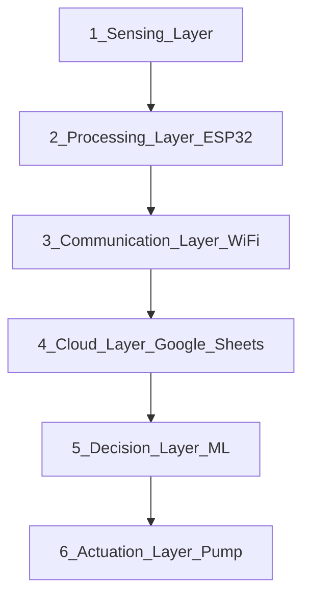
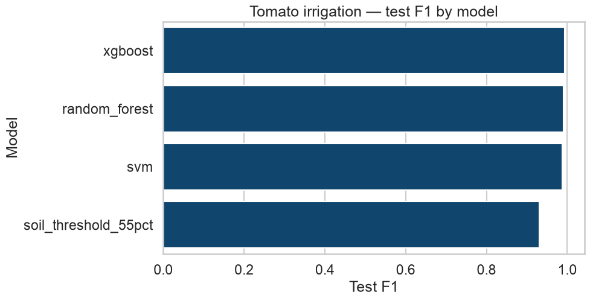
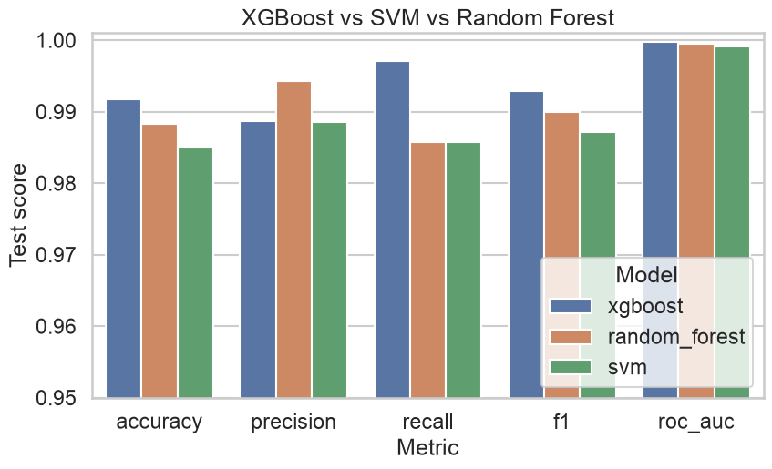

# Smart Irrigation for Tomato

Final-year project: an ESP32 sensor node (DHT11 + capacitive soil moisture + relay) plus a machine-learning service that decides when a tomato crop should be irrigated.

The hardware logs **temperature**, **humidity**, **soil moisture**, and **relay status** to Google Sheets every 15 minutes. This repository adds exploratory analysis, FAO-56 agronomic feature engineering, a comparison of **XGBoost**, **Random Forest**, and **RBF SVM**, and a FastAPI predictor that matches that payload. **XGBoost** is the production model.

## Architecture

IoT + machine-learning irrigation scheduling, in six layers:




| Layer | Name | Role |
| --- | --- | --- |
| 1 | Sensing | Soil moisture, temperature, humidity, pressure |
| 2 | Processing | ESP32 reads sensors, averages samples, local irrigation logic, prepares upload |
| 3 | Communication | Wi-Fi / internet |
| 4 | Cloud | Google Sheets: store readings, timestamps, historical dataset |
| 5 | Decision | Preprocess, FAO-56 features, compare XGBoost / Random Forest / SVM, predict, irrigation recommendation |
| 6 | Actuation | Relay + water pump ON / OFF |

The ESP32 samples every 2 seconds and uploads averages every 15 minutes. The firmware currently switches the relay when `soilMoisture <= 0`. The Decision layer is the intended replacement: irrigate from soil moisture, heat stress, and vapor-pressure deficit rather than a single dry-soil cutoff.

## Folder structure

The Arduino sketch stays in one folder so it still compiles. Sensor drivers, Wi-Fi, and the relay therefore live with the ESP32 even though they belong to different layers.

```
Smart-Irrigation-Tomato/
│
├── docs/
│   └── system-architecture.png          # six-layer system design
│
├── Sensor_reading_arduino/              # edge node (layers 1, 2, 3, 6)
│   ├── aht10.cpp                        # 1 Sensing — DHT11 temperature & humidity
│   ├── soil_moisture.cpp                # 1 Sensing — capacitive soil probe
│   │                                    # 6 Actuation — relay + pump (active-low)
│   └── SmartIrrigation.ino              # 2 Processing — read, average, local decision
│                                        # 3 Communication — Wi-Fi / HTTP to Sheets
│
├── data/                                # 4 Cloud — dataset exported from Google Sheets
│   ├── raw/                             # original Kathmandu workbook
│   └── processed/                       # model-ready CSV and simulated season
│
├── src/                                 # 5 Decision — preprocess, features, EDA, train
├── notebooks/                           # 5 Decision — FYP EDA and training notebooks
├── api/                                 # 5 Decision — FastAPI irrigation recommendation
├── models/                              # 5 Decision — saved XGBoost pipeline
├── results/                             # 5 Decision — plots, leaderboard, metrics
│
├── Dockerfile                           # Decision API image
├── docker-compose.yml
└── requirements.txt
```

| System layer | Folder / file |
| --- | --- |
| 1 Sensing | `Sensor_reading_arduino/aht10.cpp`, `soil_moisture.cpp` |
| 2 Processing | `Sensor_reading_arduino/SmartIrrigation.ino` |
| 3 Communication | Wi-Fi and `SCRIPT_URL` upload in `SmartIrrigation.ino` |
| 4 Cloud | `data/raw/`, `data/processed/` (Sheets export) |
| 5 Decision | `src/`, `notebooks/`, `api/`, `models/`, `results/` |
| 6 Actuation | Relay control in `Sensor_reading_arduino/soil_moisture.cpp` |

## Hardware

Firmware lives in `Sensor_reading_arduino/`.

| Device | Role | Pin |
| --- | --- | --- |
| ESP32 | Wi-Fi node, averaging, upload | — |
| DHT11 | Air temperature and relative humidity | GPIO 4 |
| Capacitive soil moisture | Analog moisture (AO) | GPIO 20 |
| Capacitive soil moisture | Digital threshold (DO) | GPIO 36 |
| Relay (active-low) | Pump ON/OFF | GPIO 1 |

- Soil ADC is 12-bit. Dry calibration is 3800; wet is 1400. Moisture is mapped to 0–100 %.
- Samples every 2 s; Google Sheets upload every 15 minutes. A relay-ON event is uploaded immediately.
- DHT11 does not measure pressure. The firmware sends `0`; the API substitutes the Kathmandu mean (854.27 hPa).

## Dataset

`data/raw/Soil_Moisture_Temp_Humidity_Pressure_MotorOnOff.xlsx` — 3,000 Kathmandu field readings:

| Column | Role |
| --- | --- |
| Soil Moisture | Analog probe (converted to 0–100 %) |
| Temperature | Air temperature (°C) |
| Air Humidity | Relative humidity (%) |
| Atmospheric Pressure (Kathmandu) | Air pressure (hPa) |
| Pump Data | Historical pump ON/OFF |

`data/processed/tomato_season_simulated.csv` is a FAO-56 soil-water-balance simulation of a Kathmandu spring tomato crop at the same 15-minute interval as the ESP32 uploader. It is used only for time-series EDA (diurnal cycle and growth stages). **The production model is trained on the 3,000 real logs.**

## Irrigation target

The historical pump column is close to a single soil-moisture threshold. The project label `irrigate` is a tomato-specific rule:

- management allowed depletion ≈ 0.40 (FAO-56 tomato)
- irrigate sooner on high vapor-pressure deficit or heat stress
- do not irrigate waterlogged soil

Engineered features (Tetens VPD, ET0 proxy, heat stress, moisture deficit) live in `src/features.py` and are applied both at training time and inside the saved sklearn pipeline.

## What the data shows (EDA)

Walkthrough with captions: [`notebooks/01_eda.ipynb`](notebooks/01_eda.ipynb). Rebuild figures with `PYTHONPATH=. python3 -m src.eda`.

| Finding | In plain English |
| --- | --- |
| 3,000 complete rows | No missing values; pressure 845–865 hPa matches Kathmandu, not sea level |
| Old pump ≈ soil switch | Correlation with soil moisture ≈ −0.85; heat and humidity were ignored |
| Tomato FAO label | Water near 55–60% moisture, sooner if air is hot/dry (high VPD), never if soil is waterlogged |
| They match 92.2% of the time | 207 extra “water now” decisions in heat; 26 times the tomato rule holds back |
| Soil buckets | Dry (0–30%): always irrigate. Wet (75–100%): never. The 55–75% band is where climate matters |
| No timestamps on the logs | Use a stratified 80/20 split; the simulated season is EDA-only |

Easy plots (titles are the finding, not the chart type):

- `results/figures/15_mean_by_label.png` — irrigate vs don’t, four averages
- `results/figures/16_irrigate_rate_by_soil_bin.png` — dry / low / OK / wet
- `results/figures/17_pump_vs_tomato_agreement.png` — 2×2 agreement
- `results/figures/19_what_predicts_irrigation.png` — pump follows soil only
- `results/figures/23_soil_temp_irrigate_heatmap.png` — dry+hot → water

## Setup

Python 3.12 is recommended (the Docker image uses `python:3.12-slim`).

```bash
python3 -m venv .venv
source .venv/bin/activate
python3 -m pip install -r requirements.txt
```

Place the raw workbook at `data/raw/Soil_Moisture_Temp_Humidity_Pressure_MotorOnOff.xlsx` before preprocessing.

## Pipeline

```bash
python3 -m src.preprocess
python3 -m src.generate_season
python3 -m src.eda
PYTHONPATH=. python3 -m src.train
```

| Command | What it does |
| --- | --- |
| `src.preprocess` | Loads the workbook, maps ADC to 0–100 %, adds agronomic features, writes tomato labels |
| `src.generate_season` | FAO-56 Kathmandu spring simulation (EDA only) |
| `src.eda` | Easy-read figures 01–09 and 15–23 plus `results/eda_summary.json` |
| `src.train` | Compares XGBoost, Random Forest, and RBF SVM; saves the best pipeline |

Outputs:

- `data/processed/tomato_irrigation.csv`
- `data/processed/tomato_season_simulated.csv`
- `results/figures/` — EDA (including soil bins, agreement, climate heatmap), ROC, F1, three-model comparison
- `results/model_leaderboard.csv`
- `models/irrigation_model.joblib` (XGBoost)

Notebooks (same analysis, for the report/viva):

- `notebooks/01_eda.ipynb`
- `notebooks/02_model_training.ipynb`

## Results

Held-out test set (600 rows). The Decision layer compares three classifiers against a 55 % soil-moisture cutoff. **XGBoost** is saved for the API.

| Model | Accuracy | Precision | Recall | F1 | ROC-AUC | 5-fold CV F1 |
| --- | --- | --- | --- | --- | --- | --- |
| **xgboost** | **0.992** | 0.989 | **0.997** | **0.993** | **1.000** | **0.993** |
| random_forest | 0.988 | **0.994** | 0.986 | 0.990 | 1.000 | 0.990 |
| svm | 0.985 | 0.989 | 0.986 | 0.987 | 0.999 | 0.986 |
| soil_threshold_55pct | 0.923 | 0.987 | 0.880 | 0.931 | 0.939 | — |

- **XGBoost** — best F1 and recall; production model in `models/irrigation_model.joblib`
- **Random Forest** — highest precision; close second
- **RBF SVM** — scaled features + calibrated probabilities; still well above the moisture-only baseline

All three learned models beat the agronomic 55 % cutoff by using vapor-pressure deficit and heat as well as soil moisture.





## API

Requires `models/irrigation_model.joblib` (`PYTHONPATH=. python3 -m src.train`).

```bash
PYTHONPATH=. uvicorn api.app:app --reload --port 8000
```

| Method | Path | Purpose |
| --- | --- | --- |
| GET | `/` | Service info |
| GET | `/health` | Model file present or degraded |
| POST | `/predict` | Irrigation decision |
| GET | `/docs` | Interactive OpenAPI UI |

### `POST /predict`

Request (ESP32-compatible field names):

```json
{
  "temperature": 29.2,
  "humidity": 48.0,
  "soilMoisture": 38.5,
  "pressure": 0
}
```

`pressure` of `0` or omitted is treated as missing and replaced with 854.27 hPa.

Example response:

```json
{
  "irrigate": true,
  "probability": 0.97,
  "relayStatus": "ON",
  "targetValue": 100.0,
  "model": "xgboost",
  "reasons": [
    "Soil moisture is below the tomato readily-available-water band."
  ]
}
```

`targetValue` is `100` when irrigating and `0` otherwise, matching the firmware upload convention.

## Docker

```bash
docker compose up --build
```

The API listens on port 8000. `./models` is mounted into the container so a newly trained joblib is picked up without rebuilding the image. Health check: `GET /health`.

For the API-only image without Compose:

```bash
docker build -t smart-irrigation-api .
docker run --rm -p 8000:8000 -v "$(pwd)/models:/app/models" smart-irrigation-api
```

## Firmware configuration

Edit `Sensor_reading_arduino/SmartIrrigation.ino` before flashing:

- `WIFI_SSID` / `WIFI_PASS` — local Wi-Fi
- `SCRIPT_URL` — Google Apps Script web-app URL that appends rows to Sheets

Do not commit real passwords or script URLs. After the API is running, the node can call `POST /predict` with the same JSON fields it already logs (`temperature`, `humidity`, `soilMoisture`, `pressure`).
