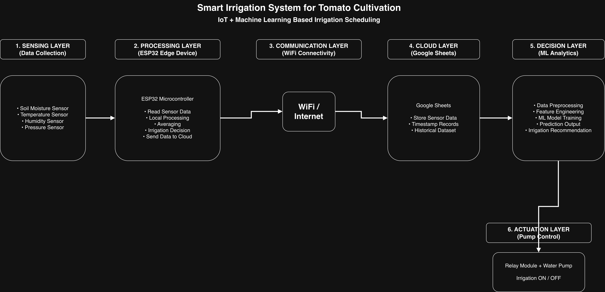
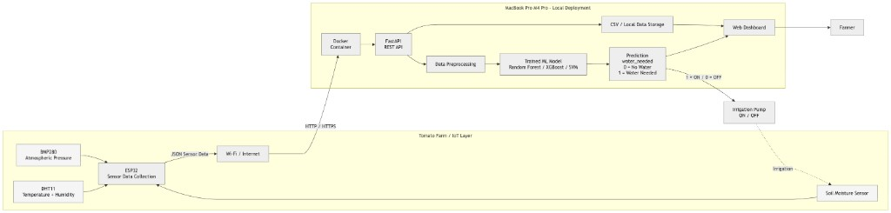
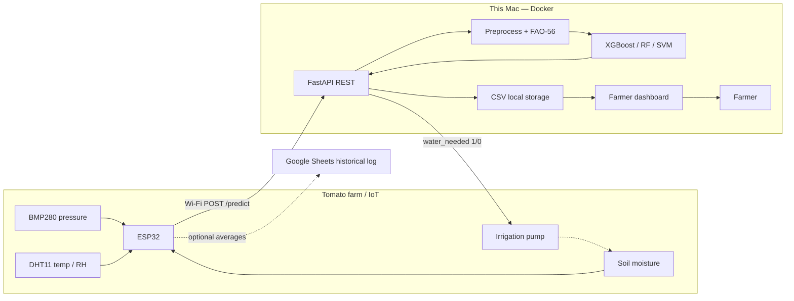

# Smart Irrigation for Tomato

Final-year project: an ESP32 greenhouse node (DHT11 + capacitive soil probe + relay/pump) talks to a **local FastAPI service on this Mac**. The service logs every reading to CSV, runs the trained **XGBoost** model, and returns `water_needed` (1 = pump ON, 0 = OFF). A farmer dashboard at `/` shows those live sensors in plain language. No AWS EC2.

## Architecture

Six logical layers ([system design](docs/Final_Year_Project_System_Design.png)) run as a closed loop on this Mac ([deployment](docs/deployment-architecture.png)). Live control is FastAPI + XGBoost, not a one-way dump into a spreadsheet.







| Layer | Design block | This repo |
| --- | --- | --- |
| 1 Sensing | Soil, temperature, humidity, pressure | DHT11 + capacitive soil + BMP280 (site 865 hPa if BMP missing) |
| 2 Processing | ESP32 read, average, decide, send | `SmartIrrigation.ino` — 2 s samples, short-window average to `/predict` |
| 3 Communication | Wi-Fi / Internet | ESP32 STA to this Mac on port 8000 |
| 4 Cloud / storage | Google Sheets timestamps + history | Live CSV `data/live/` for the dashboard; optional Sheets averages every 15 min |
| 5 Decision | Preprocess, train, predict | FastAPI + XGBoost `irrigation_model.joblib`; farmer dashboard |
| 6 Actuation | Relay + pump ON/OFF | ESP32 relay from `water_needed`; local tomato band if the API is down |

If FastAPI is unreachable, firmware falls back to `tomato_thresholds.h` (irrigate below 40 %, stop above 70 %). The ESP32 does **not** restart after a Sheets upload, so the pump loop keeps running. Training starts from the 3,000 Kathmandu logs under `data/raw/`. Live rows in `data/live/irrigation_log.csv` can be folded back into XGBoost.

## Folder structure

The Arduino sketch stays in one folder so it still compiles. Sensor drivers, Wi-Fi, and the relay therefore live with the ESP32 even though they belong to different layers.

```
Smart-Irrigation-Tomato/
│
├── docs/
│   ├── Final_Year_Project_System_Design.png  # six layers
│   └── deployment-architecture.png           # farm IoT + local Mac Docker
│
├── Sensor_reading_arduino/SmartIrrigation/
│   ├── aht10.cpp                        # DHT11 temperature & humidity
│   ├── bmp280.cpp                       # BMP280 pressure (I2C GPIO 8/9)
│   ├── soil_moisture.cpp                # soil probe + relay / pump
│   ├── tomato_thresholds.h              # local fallback if the API is down
│   ├── SmartIrrigation.ino              # Wi-Fi, POST /predict, optional Sheets
│   └── google_sheets_script.gs          # optional extra log (not the dashboard)
│
├── data/
│   ├── raw/                             # Kathmandu workbook (first training set)
│   ├── processed/                       # model-ready CSV
│   └── live/                            # irrigation_log.csv from the API
│
├── src/                                 # preprocess, FAO-56 features, train, ingest live
├── notebooks/
├── api/                                 # FastAPI + farmer dashboard
│   ├── app.py
│   ├── storage.py
│   ├── plain.py                         # farmer-facing sentences
│   ├── learn.py                         # retrain XGBoost from the live CSV
│   └── static/                          # dashboard HTML / CSS / JS
├── models/                              # irrigation_model.joblib (XGBoost)
├── results/
│
├── Dockerfile
├── docker-compose.yml
└── requirements.txt
```

| System piece | Folder / file |
| --- | --- |
| Farm sensors | `aht10.cpp`, `bmp280.cpp`, `soil_moisture.cpp` |
| ESP32 + Wi-Fi | `SmartIrrigation.ino` |
| Pump / relay | `soil_moisture.cpp` (`setRelay`) |
| FastAPI + CSV | `api/app.py`, `api/storage.py`, `data/live/` |
| Farmer dashboard | `api/static/` at `GET /` |
| Live → XGBoost | `src/ingest_live.py`, `POST /api/learn` |
| Trained model | `models/irrigation_model.joblib` |

## Hardware

Firmware lives in `Sensor_reading_arduino/SmartIrrigation/`.

| Device | Role | Pin |
| --- | --- | --- |
| ESP32 | Wi-Fi node, JSON to FastAPI, relay | — |
| DHT11 | Air temperature and relative humidity | GPIO 4 |
| BMP280 | Atmospheric pressure (I2C) | SDA GPIO 8, SCL GPIO 9 |
| Capacitive soil moisture | Analog moisture (AO) | GPIO 20 |
| Capacitive soil moisture | Digital threshold (DO) | GPIO 36 |
| Relay (active-low) | Pump ON/OFF | GPIO 1 |

- Soil ADC is 12-bit. Dry calibration is 3800; wet is 1400. Moisture is mapped to 0–100 %. Calibrate `DRY_SOIL` / `WET_SOIL` in `soil_moisture.cpp` on *your* probe.
- Samples every 2 s. A short rolling average is `POST /predict` every 15 s. Pump follows XGBoost `water_needed`.
- If the BMP280 is missing, firmware sends greenhouse site pressure **865 hPa**. If `pressure` is `0` or omitted, the API uses the Kathmandu mean **854.27 hPa**.
- Arduino Library Manager: **DHT sensor library**, **Adafruit BMP280 Library**, **Adafruit Unified Sensor**.
- Optional Google Sheets (`ENABLE_GOOGLE_SHEETS`): 15-minute averages for the historical dataset. The farmer dashboard reads `data/live/irrigation_log.csv` on this Mac, not Sheets.

## Dataset

`data/raw/Soil_Moisture_Temp_Humidity_Pressure_MotorOnOff.xlsx` — 3,000 Kathmandu field readings:

| Column | Role |
| --- | --- |
| Soil Moisture | Analog probe (converted to 0–100 %) |
| Temperature | Air temperature (°C) |
| Air Humidity | Relative humidity (%) |
| Atmospheric Pressure (Kathmandu) | Air pressure (hPa) |
| Pump Data | Historical pump ON/OFF |

`data/processed/tomato_season_simulated.csv` is a FAO-56 soil-water-balance simulation of a Kathmandu spring tomato crop at the same 15-minute interval as the ESP32 uploader. It is used only for time-series EDA (diurnal cycle and growth stages). **The first production model is trained on the 3,000 real logs.** Live greenhouse rows can be merged later (see [Learn from live greenhouse sensors](#learn-from-live-greenhouse-sensors)).

## Irrigation target

The historical pump column is close to a single soil-moisture threshold. The project label `irrigate` is a tomato-specific rule:

- management allowed depletion ≈ 0.40 (FAO-56 tomato)
- irrigate sooner on high vapor-pressure deficit or heat stress
- do not irrigate waterlogged soil

Engineered features (Tetens VPD, ET0 proxy, heat stress, moisture deficit) live in `src/features.py` and are applied both at training time and inside the saved sklearn pipeline.

## What the data shows (EDA)

Walkthrough with captions: [`notebooks/01_eda.ipynb`](notebooks/01_eda.ipynb). Rebuild figures with `PYTHONPATH=. python3 -m src.eda`.

| Finding | In plain English |
| --- | --- |
| 3,000 complete rows | No missing values; pressure 845–865 hPa matches Kathmandu, not sea level |
| Old pump ≈ soil switch | Correlation with soil moisture ≈ −0.85; heat and humidity were ignored |
| Tomato FAO label | Water near 55–60% moisture, sooner if air is hot/dry (high VPD), never if soil is waterlogged |
| They match 92.2% of the time | 207 extra “water now” decisions in heat; 26 times the tomato rule holds back |
| Soil buckets | Dry (0–30%): always irrigate. Wet (75–100%): never. The 55–75% band is where climate matters |
| No timestamps on the logs | Use a stratified 80/20 split; the simulated season is EDA-only |

Easy plots (titles are the finding, not the chart type):

- `results/figures/15_mean_by_label.png` — irrigate vs don’t, four averages
- `results/figures/16_irrigate_rate_by_soil_bin.png` — dry / low / OK / wet
- `results/figures/17_pump_vs_tomato_agreement.png` — 2×2 agreement
- `results/figures/19_what_predicts_irrigation.png` — pump follows soil only
- `results/figures/23_soil_temp_irrigate_heatmap.png` — dry+hot → water

## Setup

Python 3.12 is recommended (the Docker image uses `python:3.12-slim`).

```bash
python3 -m venv .venv
source .venv/bin/activate
python3 -m pip install -r requirements.txt
```

Place the raw workbook at `data/raw/Soil_Moisture_Temp_Humidity_Pressure_MotorOnOff.xlsx` before preprocessing.

## Pipeline

```bash
python3 -m src.preprocess
python3 -m src.generate_season
python3 -m src.eda
PYTHONPATH=. python3 -m src.train
```

| Command | What it does |
| --- | --- |
| `src.preprocess` | Loads the workbook, maps ADC to 0–100 %, adds agronomic features, writes tomato labels |
| `src.generate_season` | FAO-56 Kathmandu spring simulation (EDA only) |
| `src.eda` | Easy-read figures 01–09 and 15–23 plus `results/eda_summary.json` |
| `src.train` | Compares XGBoost, Random Forest, and RBF SVM; saves the best pipeline |
| `src.ingest_live` | Merges `data/live/irrigation_log.csv` into the training CSV (optional `--train`) |

Checks: `PYTHONPATH=. python3 -m pytest tests/ -q`

Outputs:

- `data/processed/tomato_irrigation.csv`
- `data/processed/tomato_season_simulated.csv`
- `results/figures/` — EDA (including soil bins, agreement, climate heatmap), ROC, F1, three-model comparison
- `results/model_leaderboard.csv`
- `models/irrigation_model.joblib` (XGBoost)

Notebooks (same analysis, for the report/viva):

- `notebooks/01_eda.ipynb` — EDA only; runs in Google Colab without training or the API ([Open in Colab](https://colab.research.google.com/github/pramodgiri2468/FYP_Smart_Irrigation_Tomato/blob/main/notebooks/01_eda.ipynb))
- `notebooks/02_model_training.ipynb`

## Results

Held-out test set (600 rows). The Decision layer compares three classifiers against a 55 % soil-moisture cutoff. **XGBoost** is saved for the API.

| Model | Accuracy | Precision | Recall | F1 | ROC-AUC | 5-fold CV F1 |
| --- | --- | --- | --- | --- | --- | --- |
| **xgboost** | **0.992** | 0.989 | **0.997** | **0.993** | **1.000** | **0.993** |
| random_forest | 0.988 | **0.994** | 0.986 | 0.990 | 1.000 | 0.990 |
| svm | 0.985 | 0.989 | 0.986 | 0.987 | 0.999 | 0.986 |
| soil_threshold_55pct | 0.923 | 0.987 | 0.880 | 0.931 | 0.939 | — |

- **XGBoost** — best F1 and recall; production model in `models/irrigation_model.joblib`
- **Random Forest** — highest precision; close second
- **RBF SVM** — scaled features + calibrated probabilities; still well above the moisture-only baseline

All three learned models beat the agronomic 55 % cutoff by using vapor-pressure deficit and heat as well as soil moisture.


## Deploy on this PC (no AWS)

The model file is `models/irrigation_model.joblib`. You serve it with FastAPI on **this computer**. Nothing is uploaded to EC2 or any cloud GPU.

**Option A — Docker (recommended).** Docker Desktop must be running (whale icon in the menu bar).

```bash
cd ~/Desktop/Smart-Irrigation-Tomato
open -a Docker          # skip if already running
docker compose up -d --build
```

Check: farmer dashboard http://127.0.0.1:8000/ — health JSON http://127.0.0.1:8000/health

If you see `Bind for 0.0.0.0:8000 failed: port is already allocated`, the API is **already up**. Do not run `docker run ...` as well. Use:

```bash
docker compose ps
docker compose logs -f api
```

Stop it with `docker compose down`. After you change `api/` or `src/`, rebuild with `docker compose up -d --build` (the dashboard HTML is copied into the image). `models/`, `data/`, and `results/` are mounted, so live CSV, retraining, and a new joblib work inside Docker.

**Option B — Python venv (no Docker).** Use this if Docker is not running. Stop Option A first so port 8000 is free.

```bash
cd ~/Desktop/Smart-Irrigation-Tomato
source .venv/bin/activate
PYTHONPATH=. python -m uvicorn api.app:app --host 0.0.0.0 --port 8000
```

`--host 0.0.0.0` lets the ESP32 on the same Wi-Fi call this Mac. `--reload` is only for development.

Do not prefix the command with `. ` (bash `source`). That tries to run the uvicorn file as a shell script and fails.

**Call it from another device (ESP32 / phone).** Find this Mac’s LAN IP (System Settings → Network, or `ipconfig getifaddr en0`). Example:

```bash
curl -sS http://192.168.1.79:8000/health
curl -sS -X POST http://192.168.1.79:8000/predict \
  -H 'Content-Type: application/json' \
  -d '{"temperature":29.2,"humidity":48.0,"soilMoisture":38.5,"pressure":865}'
```

Keep the Mac awake and on the same Wi-Fi as the ESP32. macOS Firewall (System Settings → Network → Firewall) must allow incoming connections on port 8000. This is a home/LAN service, not a public internet deployment.

| Method | Path | Purpose |
| --- | --- | --- |
| GET | `/` | Farmer dashboard (plain language, live sensors) |
| GET | `/health` | Model file present; whether a reading is live |
| POST | `/predict` | Irrigation decision + CSV log (ESP32) |
| GET | `/api/status` | Latest reading, farmer phrases, pump state |
| GET | `/api/logs` | Recent CSV rows as JSON |
| GET | `/api/logs.csv` | Download the live log |
| POST | `/api/learn` | Retrain XGBoost from the live greenhouse log |
| GET | `/docs` | Interactive OpenAPI UI |

### Farmer dashboard

http://127.0.0.1:8000/ refreshes every 3 seconds from `/api/status` and `/api/logs`.

The farmer sees:

- **Water the plants now** or **Soil is fine — keep the pump off**
- Soil water, air temperature, air humidity, with short labels (Too dry / Good / Hot)
- Pump running or stopped
- A green **Live greenhouse** pill when a reading arrived in the last 90 seconds
- A soil line chart and a table of recent Watered / Waited rows

Until the ESP32 posts, the page stays on “Waiting for sensors…”.

### `POST /predict`

Request (ESP32-compatible field names):

```json
{
  "temperature": 29.2,
  "humidity": 48.0,
  "soilMoisture": 38.5,
  "pressure": 865
}
```

`pressure` of `0` or omitted is treated as missing and replaced with 854.27 hPa.

Example response:

```json
{
  "water_needed": 1,
  "irrigate": true,
  "probability": 0.97,
  "relayStatus": "ON",
  "targetValue": 100.0,
  "model": "xgboost",
  "logged": true,
  "headline": "Water the plants now",
  "soil_plain": "Too dry",
  "pump_plain": "Running",
  "reasons": [
    "The soil is too dry for tomato roots."
  ]
}
```

`water_needed` is `1` (pump ON) or `0` (pump OFF). Every call is appended to `data/live/irrigation_log.csv`. The ESP32 only needs `water_needed`.

## Learn from live greenhouse sensors

Live `/predict` rows are **inference**, not labels. Do not retrain using the CSV `water_needed` column (that is the old model talking to itself). Labels for a live update still come from the tomato FAO rule in `src/features.py`.

1. Run the API (Docker or uvicorn) and flash the ESP32 so Serial shows `POST /predict` and HTTP 200.
2. Collect at least **50** unique greenhouse readings (dry/wet soil and hot/cool air if you can).
3. Either click **Update model from greenhouse log** on the dashboard, or:

```bash
source .venv/bin/activate
PYTHONPATH=. python3 -m src.ingest_live --train
```

That merges Arduino rows into `data/processed/tomato_irrigation.csv`, retrains, and writes `models/irrigation_model.joblib`. The API reloads the file on the next `/predict` (mtime check). Arduino-only training: add `--live-only` once the live log is large.

`POST /api/learn` does the same merge + train in a background thread. It refuses until 50 live rows exist.

## Firmware configuration

Edit `Sensor_reading_arduino/SmartIrrigation/SmartIrrigation.ino` before flashing:

- `WIFI_SSID` / `WIFI_PASS` — same Wi-Fi as this Mac (do not commit real passwords)
- `ENABLE_FASTAPI` — `1` to send live JSON to this PC (pump follows XGBoost)
- `API_HOST` — this Mac’s LAN IP (`ipconfig getifaddr en0`), default port 8000
- `ENABLE_GOOGLE_SHEETS` / `SCRIPT_URL` — optional 15-minute historical log

Install the three Adafruit/DHT libraries, wire BMP280 to GPIO 8/9 (or change `BMP_SDA` / `BMP_SCL` in `bmp280.cpp`), then flash. Keep Docker Compose (or uvicorn) running so `/predict` is reachable. If the API is down, `updateTomatoRelay` in `soil_moisture.cpp` uses `tomato_thresholds.h`.
