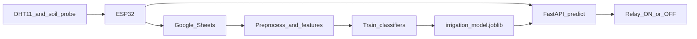

# Smart Irrigation for Tomato

Final-year project: an ESP32 sensor node (DHT11 + capacitive soil moisture + relay) plus a machine-learning service that decides when a tomato crop should be irrigated.

The hardware logs **temperature**, **humidity**, **soil moisture**, and **relay status** to Google Sheets every 15 minutes. This repository adds exploratory analysis, FAO-56 agronomic feature engineering, model training, and a FastAPI predictor that matches that payload.

## Architecture



1. The ESP32 samples sensors every 2 seconds and uploads averages every 15 minutes.
2. Field logs are preprocessed into tomato irrigation labels and FAO-56 features.
3. Classifiers are compared; the best pipeline is saved for inference.
4. `POST /predict` returns whether the pump should turn ON or OFF.

The firmware currently switches the relay when `soilMoisture <= 0`. The trained API is the intended replacement: irrigate from soil moisture, heat stress, and vapor-pressure deficit rather than a single dry-soil cutoff.

## Hardware

Firmware lives in `Sensor_reading_arduino/`.

| Device | Role | Pin |
| --- | --- | --- |
| ESP32 | Wi-Fi node, averaging, upload | — |
| DHT11 | Air temperature and relative humidity | GPIO 4 |
| Capacitive soil moisture | Analog moisture (AO) | GPIO 20 |
| Capacitive soil moisture | Digital threshold (DO) | GPIO 36 |
| Relay (active-low) | Pump ON/OFF | GPIO 1 |

- Soil ADC is 12-bit. Dry calibration is 3800; wet is 1400. Moisture is mapped to 0–100 %.
- Samples every 2 s; Google Sheets upload every 15 minutes. A relay-ON event is uploaded immediately.
- DHT11 does not measure pressure. The firmware sends `0`; the API substitutes the Kathmandu mean (854.27 hPa).

## Dataset

`data/raw/Soil_Moisture_Temp_Humidity_Pressure_MotorOnOff.xlsx` — 3,000 Kathmandu field readings:

| Column | Role |
| --- | --- |
| Soil Moisture | Analog probe (converted to 0–100 %) |
| Temperature | Air temperature (°C) |
| Air Humidity | Relative humidity (%) |
| Atmospheric Pressure (Kathmandu) | Air pressure (hPa) |
| Pump Data | Historical pump ON/OFF |

`data/processed/tomato_season_simulated.csv` is a FAO-56 soil-water-balance simulation of a Kathmandu spring tomato crop at the same 15-minute interval as the ESP32 uploader. It is used only for time-series EDA (diurnal cycle and growth stages). **The production model is trained on the 3,000 real logs.**

## Irrigation target

The historical pump column is close to a single soil-moisture threshold. The project label `irrigate` is a tomato-specific rule:

- management allowed depletion ≈ 0.40 (FAO-56 tomato)
- irrigate sooner on high vapor-pressure deficit or heat stress
- do not irrigate waterlogged soil

Engineered features (Tetens VPD, ET0 proxy, heat stress, moisture deficit) live in `src/features.py` and are applied both at training time and inside the saved sklearn pipeline.

## Setup

Python 3.12 is recommended (the Docker image uses `python:3.12-slim`).

```bash
python3 -m venv .venv
source .venv/bin/activate
python3 -m pip install -r requirements.txt
```

Place the raw workbook at `data/raw/Soil_Moisture_Temp_Humidity_Pressure_MotorOnOff.xlsx` before preprocessing.

## Pipeline

```bash
python3 -m src.preprocess
python3 -m src.generate_season
python3 -m src.eda
python3 -m src.train
```

| Command | What it does |
| --- | --- |
| `src.preprocess` | Loads the workbook, maps ADC to 0–100 %, adds agronomic features, writes tomato labels |
| `src.generate_season` | FAO-56 Kathmandu spring simulation (EDA only) |
| `src.eda` | Figures and summaries under `results/` |
| `src.train` | Compares classifiers and saves the best pipeline |

Outputs:

- `data/processed/tomato_irrigation.csv`
- `data/processed/tomato_season_simulated.csv`
- `results/figures/` — EDA and training plots
- `results/model_leaderboard.csv`
- `models/irrigation_model.joblib`

Notebooks (same analysis, for the report/viva):

- `notebooks/01_eda.ipynb`
- `notebooks/02_model_training.ipynb`

## Results

Held-out test set (600 rows). Best model: **Histogram Gradient Boosting**.

| Model | Accuracy | F1 | ROC-AUC |
| --- | --- | --- | --- |
| hist_gradient_boosting | 0.992 | 0.993 | 1.000 |
| random_forest | 0.988 | 0.990 | 1.000 |
| logistic_regression | 0.987 | 0.988 | 0.999 |
| decision_tree | 0.982 | 0.984 | 0.990 |
| soil_threshold_55pct | 0.923 | 0.931 | 0.939 |
| dummy_stratified | 0.473 | 0.541 | 0.462 |

The FAO-style label is harder than copying the historical pump column. A fixed 55 % soil-moisture cutoff is the agronomic baseline; the trained models beat it by using VPD and heat as well as moisture.

## API

Requires `models/irrigation_model.joblib` (run `python3 -m src.train` first).

```bash
PYTHONPATH=. uvicorn api.app:app --reload --port 8000
```

| Method | Path | Purpose |
| --- | --- | --- |
| GET | `/` | Service info |
| GET | `/health` | Model file present or degraded |
| POST | `/predict` | Irrigation decision |
| GET | `/docs` | Interactive OpenAPI UI |

### `POST /predict`

Request (ESP32-compatible field names):

```json
{
  "temperature": 29.2,
  "humidity": 48.0,
  "soilMoisture": 38.5,
  "pressure": 0
}
```

`pressure` of `0` or omitted is treated as missing and replaced with 854.27 hPa.

Example response:

```json
{
  "irrigate": true,
  "probability": 0.97,
  "relayStatus": "ON",
  "targetValue": 100.0,
  "model": "hist_gradient_boosting",
  "reasons": [
    "Soil moisture is below the tomato readily-available-water band."
  ]
}
```

`targetValue` is `100` when irrigating and `0` otherwise, matching the firmware upload convention.

## Docker

```bash
docker compose up --build
```

The API listens on port 8000. `./models` is mounted into the container so a newly trained joblib is picked up without rebuilding the image. Health check: `GET /health`.

For the API-only image without Compose:

```bash
docker build -t smart-irrigation-api .
docker run --rm -p 8000:8000 -v "$(pwd)/models:/app/models" smart-irrigation-api
```

## Firmware configuration

Edit `Sensor_reading_arduino/SmartIrrigation.ino` before flashing:

- `WIFI_SSID` / `WIFI_PASS` — local Wi-Fi
- `SCRIPT_URL` — Google Apps Script web-app URL that appends rows to Sheets

Do not commit real passwords or script URLs. After the API is running, the node can call `POST /predict` with the same JSON fields it already logs (`temperature`, `humidity`, `soilMoisture`, `pressure`).

## Project layout

```
Sensor_reading_arduino/   ESP32 firmware (DHT11, soil, relay, Sheets upload)
data/raw/                 original Kathmandu workbook
data/processed/           model-ready CSV and simulated season
src/                      preprocess, features, EDA, season sim, train
notebooks/                FYP notebooks
api/                      FastAPI service
models/                   saved sklearn pipeline (irrigation_model.joblib)
results/                  plots, leaderboard, classification report
Dockerfile                API image
docker-compose.yml        API service on port 8000
requirements.txt          full Python stack (training + API + notebooks)
```
