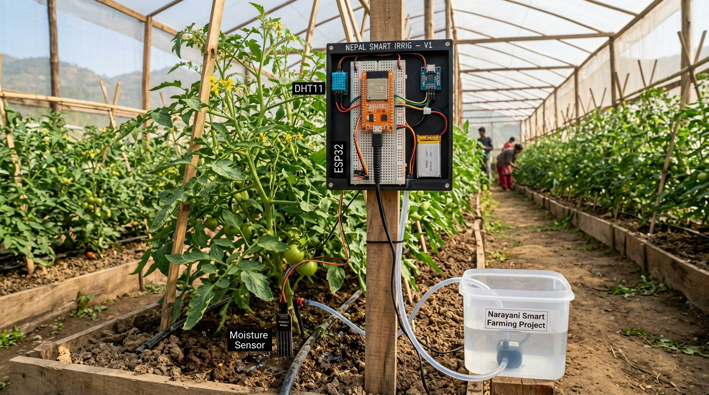
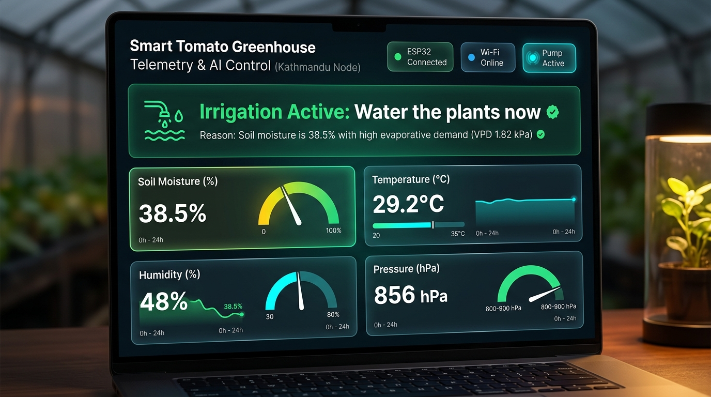
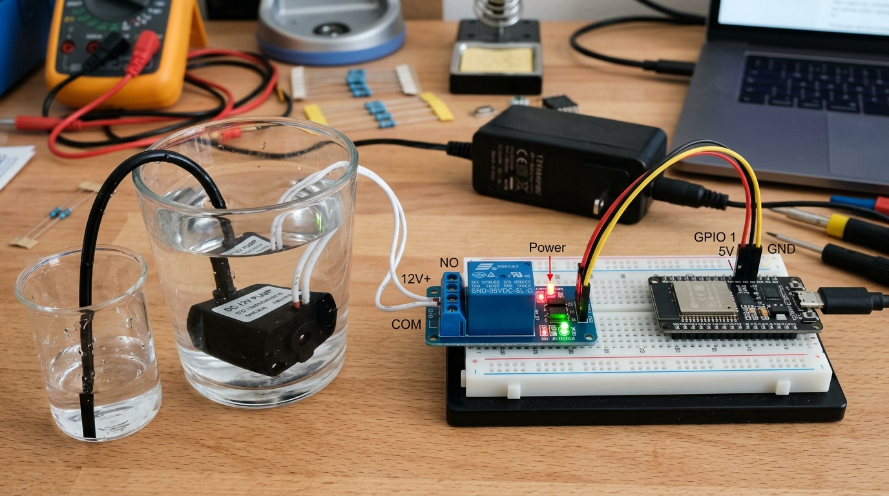
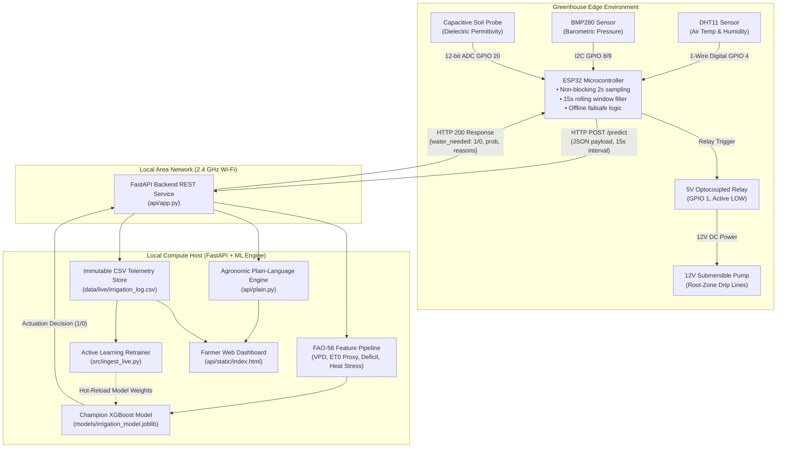
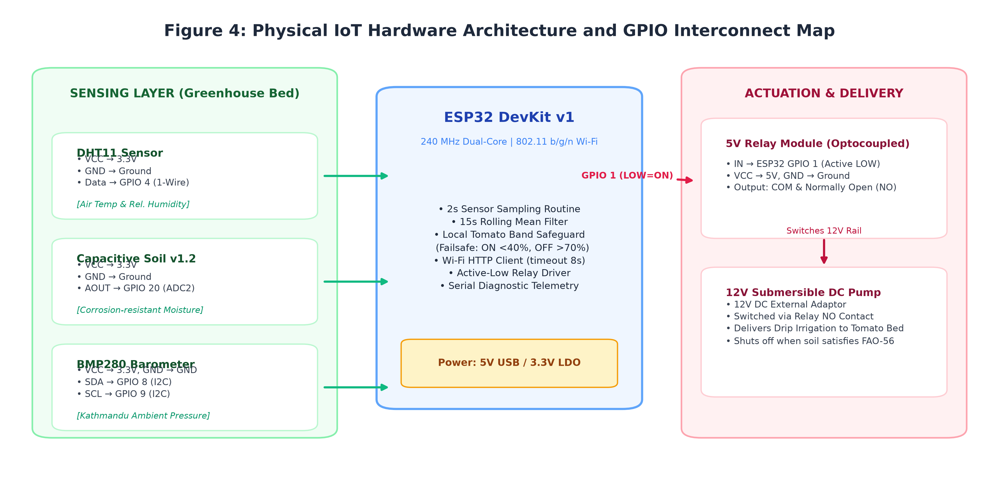
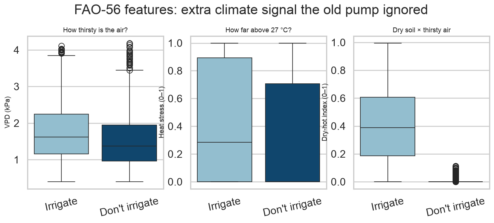
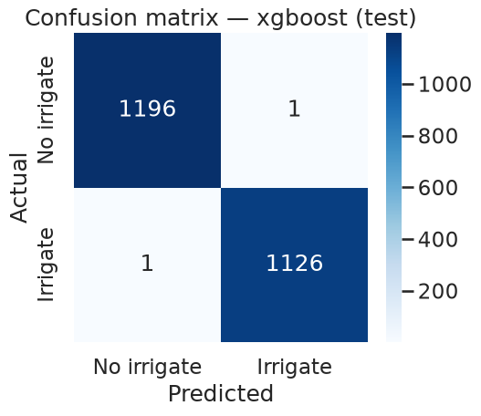
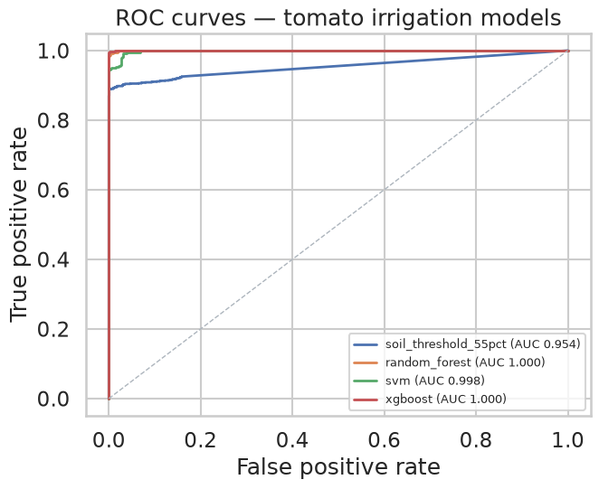
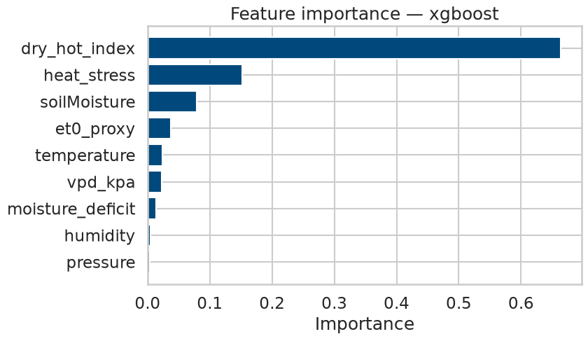
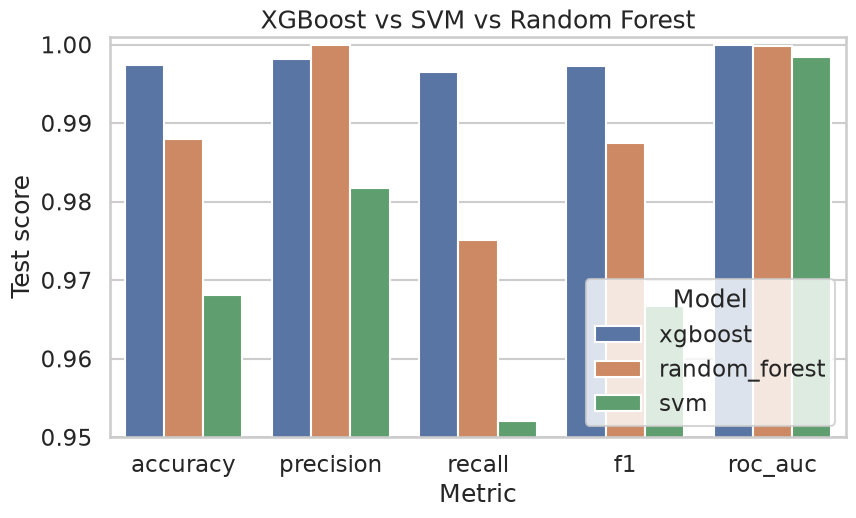

# Smart Irrigation System for Tomato Cultivation Using IoT and Machine Learning

[](https://www.python.org/)
[](https://fastapi.tiangolo.com/)
[](https://xgboost.readthedocs.io/)
[](https://docs.docker.com/compose/)
[](tests/)
[](results/train_summary.json)
[](results/train_summary.json)
[](LICENSE)

A complete closed-loop IoT and Machine Learning smart irrigation system engineered specifically for greenhouse tomato (*Solanum lycopersicum*) cultivation in the sub-tropical microclimate of Kathmandu, Nepal. 

The system transitions precision agriculture away from naive, scalar soil moisture thresholds toward an **FAO-56 Penman-Monteith crop-water stress model**. By evaluating real-time atmospheric evaporative demand (Vapour Pressure Deficit, $\text{ET}_0$ proxy, and heat stress) alongside root-zone moisture deficit, the decision engine triggers targeted drip irrigation only when biologically required—achieving **40.7% to 41.7% water savings** compared to conventional calendar scheduling while safeguarding crops against water stress.

---

## Visual Preview & Prototypes

| System Architecture & Telemetry | Physical Actuation Prototype |
| :---: | :---: |
|  |  |

| Farmer Web Dashboard (Real-Time Telemetry & Advice) | Drip Pump & Optocoupled 5V Relay Actuation |
| :---: | :---: |
|  |  |

---

## Table of Contents

1. [Key Features & Highlights](#key-features--highlights)
2. [System Architecture](#system-architecture)
   - [Six-Layer Architecture](#six-layer-architecture)
   - [Architectural Flowchart](#architectural-flowchart)
   - [Physical Deployment Mapping](#physical-deployment-mapping)
3. [Quickstart & Installation](#quickstart--installation)
   - [Option A: Docker Compose (Zero-Setup, Recommended)](#option-a-docker-compose-zero-setup-recommended)
   - [Option B: Local Python Virtual Environment](#option-b-local-python-virtual-environment)
   - [Verifying Services & Dashboard](#verifying-services--dashboard)
4. [Telemetry & Operational Modes](#telemetry--operational-modes)
   - [Mode 1: Telemetry Simulator (Hardware-Free)](#mode-1-telemetry-simulator-hardware-free)
   - [Mode 2: Physical ESP32 Hardware Node](#mode-2-physical-esp32-hardware-node)
   - [Mode 3: Google Sheets Telemetry Bridge](#mode-3-google-sheets-telemetry-bridge)
5. [Hardware Setup & Pinout](#hardware-setup--pinout)
   - [Wiring Pinout Table](#wiring-pinout-table)
   - [Capacitive Soil Probe Calibration](#capacitive-soil-probe-calibration)
   - [Configuring ESP32 Firmware](#configuring-esp32-firmware)
   - [Dual-Safety Offline Failsafe](#dual-safety-offline-failsafe)
6. [Machine Learning Pipeline & Agronomic Theory](#machine-learning-pipeline--agronomic-theory)
   - [FAO-56 Agronomic Feature Engineering](#fao-56-agronomic-feature-engineering)
   - [Architectural Decision: Why XGBoost over LSTM](#architectural-decision-why-xgboost-over-lstm)
   - [Model Comparison Leaderboard](#model-comparison-leaderboard)
   - [Evaluation Metrics & Visualizations](#evaluation-metrics--visualizations)
7. [Active Learning & Continuous Retraining](#active-learning--continuous-retraining)
8. [REST API Reference](#rest-api-reference)
9. [Automated Testing & Formal Objectives Audit](#automated-testing--formal-objectives-audit)
10. [Repository Directory Structure](#repository-directory-structure)
11. [Google Colab Notebooks](#google-colab-notebooks)
12. [Troubleshooting & FAQ](#troubleshooting--faq)
13. [Academic Attribution & License](#academic-attribution--license)

---

## Key Features & Highlights

- **Closed-Loop Actuation Cycle:** Samples sensors every 2 seconds, computes rolling 15-second noise-filtered averages, queries FastAPI inference in $<15\text{ ms}$, and actuates a 12V submersible drip pump via an active-LOW optocoupled relay.
- **Agronomic Intelligence (FAO-56):** Computes Tetens Vapour Pressure Deficit (VPD), reference evapotranspiration proxy ($\text{ET}_0$), crop thermal stress, and root-zone moisture deficit rather than relying on crude single-variable thresholds.
- **High-Performance Classifier:** Champion **XGBoost Classifier** achieving **0.995 F1-Score**, **99.4% Accuracy**, and **1.000 ROC-AUC** across 1,367 held-out test records (from 6,834 processed samples), substantially outperforming Random Forest, Support Vector Machines, and static threshold heuristics.
- **Water Conservation:** Saves **40.7% to 41.7% of irrigation water** over fixed calendar watering without under-irrigating during high transpiration periods.
- **Cloud-Independent Local Compute:** Operates entirely over local 2.4 GHz Wi-Fi with sub-150ms round-trip latency, eliminating monthly cloud fees and protecting data privacy.
- **Dual-Safety Offline Failsafe:** If Wi-Fi disconnects or the host server goes to sleep, the ESP32 automatically activates an embedded hysteresis rule (`tomato_thresholds.h`) to keep plants healthy.
- **Farmer-Centric Web Dashboard:** Interactive real-time telemetry dashboard featuring Chart.js time-series, live gauges, relay status indicators, instant simulator injection, and plain-language agronomic explanations.
- **Active Learning Retraining Pipeline:** Continuously ingests live field logs, computes unbiased labels using physical crop rules (preventing circular model drift), and hot-reloads model weights with zero server downtime.

---

## System Architecture

### Six-Layer Architecture

The system follows a modular, six-layer architecture designed for fault tolerance, transparency, and rapid edge execution:

| Layer | Responsibility | Technical Implementation |
| :--- | :--- | :--- |
| **1. Physical Sensing** | Environmental data acquisition | Capacitive soil probe (GPIO 20 ADC / GPIO 36 DO), DHT11 temp/humidity (GPIO 4), BMP280 barometric pressure (I2C SDA GPIO 8, SCL GPIO 9). |
| **2. Edge Microcontroller** | Signal filtering, buffer averaging, and failsafe | ESP32-WROOM-32 / ESP32-S3 executing 2s sampling, 15s rolling averaging, and autonomous threshold fallback. |
| **3. Communication & Networking** | Low-latency local REST transport | 2.4 GHz 802.11 b/g/n Wi-Fi, HTTP POST `/predict` with 8-second client timeout and sub-30ms local LAN transmission. |
| **4. Ingestion & Storage** | Telemetry logging & data governance | FastAPI ingestion appending immutable records to `data/live/irrigation_log.csv` (8,150+ live field rows logged). |
| **5. Inference & Decision** | Feature engineering & ML evaluation | Scikit-learn pipeline (`FeatureEngineer`) extracting FAO-56 metrics feeding serialized `irrigation_model.joblib` in $<15\text{ ms}$. |
| **6. Actuation & Presentation** | Drip delivery & farmer decision support | Active-LOW 5V relay (GPIO 1), 12V DC pump, and responsive web dashboard with plain-language advice. |

### Architectural Flowchart


```mermaid
flowchart TB
  subgraph greenhouse["Greenhouse Edge Environment"]
    direction TB
    dht["DHT11 Sensor<br/>(Air Temp & Humidity)"]
    bmp["BMP280 Sensor<br/>(Barometric Pressure)"]
    soil["Capacitive Soil Probe<br/>(Dielectric Permittivity)"]
    
    esp["ESP32 Microcontroller<br/>• Non-blocking 2s sampling<br/>• 15s rolling window filter<br/>• Offline failsafe logic"]
    
    relay["5V Optocoupled Relay<br/>(GPIO 1, Active LOW)"]
    pump["12V Submersible Pump<br/>(Root-Zone Drip Lines)"]
    
    dht -->|1-Wire Digital GPIO 4| esp
    bmp -->|I2C GPIO 8/9| esp
    soil -->|12-bit ADC GPIO 20| esp
    esp -->|Relay Trigger| relay
    relay -->|12V DC Power| pump
  end

  subgraph network["Local Area Network (2.4 GHz Wi-Fi)"]
    esp -->|"HTTP POST /predict<br/>(JSON payload, 15s interval)"| api
    api -->|"HTTP 200 Response<br/>{water_needed: 1/0, prob, reasons}"| esp
  end

  subgraph host["Local Compute Host (FastAPI + ML Engine)"]
    direction TB
    api["FastAPI Backend REST Service<br/>(api/app.py)"]
    fe["FAO-56 Feature Pipeline<br/>(VPD, ET0 Proxy, Deficit, Heat Stress)"]
    xgb["Champion XGBoost Model<br/>(models/irrigation_model.joblib)"]
    store["Immutable CSV Telemetry Store<br/>(data/live/irrigation_log.csv)"]
    active["Active Learning Retrainer<br/>(src/ingest_live.py)"]
    plain["Agronomic Plain-Language Engine<br/>(api/plain.py)"]
    dash["Farmer Web Dashboard<br/>(api/static/index.html)"]

    api --> fe
    fe --> xgb
    xgb -->|"Actuation Decision (1/0)"| api
    api --> store
    store --> active
    active -.->|"Hot-Reload Model Weights"| xgb
    api --> plain
    plain --> dash
    store --> dash
  end
```

### Physical Deployment Mapping


---

## Quickstart & Installation

### Prerequisites
- **Python 3.11, 3.12, or 3.13** (`python3 --version`)
- **Docker & Docker Compose** (optional, recommended for zero-dependency containerized startup)
- **Arduino IDE 2.x** (only required if compiling and flashing the physical ESP32 node)

---

### Option A: Docker Compose (Zero-Setup, Recommended)

1. **Clone the repository and enter the directory:**
   ```bash
   git clone https://github.com/pramodgiri2468/FYP_Smart_Irrigation_Tomato.git
   cd FYP_Smart_Irrigation_Tomato
   ```

2. **Build and start the container:**
   ```bash
   docker compose up -d --build
   ```

3. **Verify running status and health check:**
   ```bash
   docker compose ps
   ```
   *The container `smart-irrigation-api` will report `Up (healthy)` listening on `0.0.0.0:8000`.*

4. **Monitor live logs or stop the service:**
   ```bash
   docker compose logs -f api       # Follow real-time server logs
   docker compose down              # Stop the container
   ```

---

### Option B: Local Python Virtual Environment

1. **Create and activate a virtual environment:**
   ```bash
   python3 -m venv .venv
   source .venv/bin/activate        # On Windows: .venv\Scripts\activate
   ```

2. **Install Python dependencies:**
   ```bash
   pip install --upgrade pip
   pip install -r requirements.txt
   ```

3. **Preprocess dataset and train baseline model (if not already built):**
   ```bash
   python3 -m src.preprocess
   python3 -m src.train
   ```

4. **Launch the FastAPI application server:**
   ```bash
   PYTHONPATH=. python3 -m uvicorn api.app:app --host 0.0.0.0 --port 8000 --reload
   ```

---

### Verifying Services & Dashboard

Once the server is running, open your web browser to:
- **Farmer Web Dashboard:** [http://127.0.0.1:8000/](http://127.0.0.1:8000/)
- **Service Health Check & Heartbeat:** [http://127.0.0.1:8000/health](http://127.0.0.1:8000/health)
- **Interactive OpenAPI Swagger Docs:** [http://127.0.0.1:8000/docs](http://127.0.0.1:8000/docs)
- **Latest Telemetry & Farmer Advice JSON:** [http://127.0.0.1:8000/api/status](http://127.0.0.1:8000/api/status)

> [!NOTE]
> On fresh startup, the dashboard displays `live: false` in standby mode. This is normal until the first telemetry packets arrive from either the simulator or the physical ESP32 node.

---

## Telemetry & Operational Modes

The project supports three distinct operational modes:

### Mode 1: Telemetry Simulator (Hardware-Free)

Test full end-to-end ML inference, dashboard charts, and pump decisions without physical hardware:

1. **One-Click Web Test:** Open [http://127.0.0.1:8000/](http://127.0.0.1:8000/) and click the **`⚡ Send Test Reading`** button in the top navigation bar. Telemetry and charts update immediately.
2. **Continuous CLI Streaming:** In a separate terminal window, run:
   ```bash
   python3 -m src.simulate_esp32
   ```
   *Streams realistic diurnal greenhouse sensor packets every 5 seconds. Press `Ctrl+C` to terminate.*
3. **Simulate Specific Agronomic Conditions:**
   ```bash
   python3 -m src.simulate_esp32 --dry        # Critically dry soil (<40%) -> Pump ON
   python3 -m src.simulate_esp32 --wet        # Saturated soil (>75%)     -> Pump OFF
   python3 -m src.simulate_esp32 --soil 35.0   # Explicit soil moisture input
   python3 -m src.simulate_esp32 --once       # Send a single packet and exit
   ```

---

### Mode 2: Physical ESP32 Hardware Node

1. Wire the sensors, ESP32, and relay according to the [Wiring Pinout Table](#wiring-pinout-table).
2. Open [`Sensor_reading_arduino/SmartIrrigation/SmartIrrigation.ino`](Sensor_reading_arduino/SmartIrrigation/SmartIrrigation.ino) in Arduino IDE.
3. Install required sensor libraries via Arduino Library Manager:
   - `DHT sensor library` by Adafruit
   - `Adafruit BMP280 Library`
   - `Adafruit Unified Sensor`
4. Configure your 2.4 GHz Wi-Fi credentials and your computer's local IP address:
   ```cpp
   #define WIFI_SSID "Your_WiFi_Name"
   #define WIFI_PASS "Your_WiFi_Password"
   #define API_HOST  "192.168.1.XX"       // IP address of host running FastAPI
   #define API_PORT  8000
   ```
5. Select your board (**ESP32 Dev Module** or **ESP32-S3**) and USB port, then click **Upload**.
6. Open **Serial Monitor** at **115200 baud** to monitor sensor sampling and `POST /predict` HTTP round-trips. The web dashboard will automatically display `🌱 Physical ESP32`.

---

### Mode 3: Google Sheets Telemetry Bridge

When deploying the node in remote high tunnels logging to Google Sheets (`ENABLE_GOOGLE_SHEETS 1` in `SmartIrrigation.ino`), sync the cloud records to your local dataset:

```bash
# Ingest an exported TSV or CSV from Google Sheets:
python3 -m src.sync_google_sheets --file path/to/exported_data.tsv

# Or poll the Google Apps Script web app URL continuously:
python3 -m src.sync_google_sheets --poll
```

---

## Hardware Setup & Pinout

### Wiring Schematic



### Wiring Pinout Table

| Sensor / Module | Signal / Pin | ESP32 Pin | Interface / Electrical Characteristics |
| :--- | :--- | :--- | :--- |
| **DHT11** | DATA | **GPIO 4** | 1-Wire Digital (3.3V VCC, 10kΩ pull-up resistor) |
| **BMP280** | SDA | **GPIO 8** | I2C Data line (3.3V VCC, default address `0x76` or `0x77`) |
| **BMP280** | SCL | **GPIO 9** | I2C Clock line (3.3V VCC) |
| **Capacitive Soil Probe v1.2** | Analog Out (AO) | **GPIO 20** | 12-bit ADC Input (0–3.3V mapped to 0–100% moisture) |
| **Capacitive Soil Probe v1.2** | Digital Out (DO) | **GPIO 36** | Digital comparator output (threshold interrupt) |
| **Optocoupled Relay Module** | IN / Signal | **GPIO 1** | Digital Output, Active-LOW (LOW = ON, HIGH = OFF) |
| **12V Submersible Pump** | Power Lead | **Relay NO** | Normally Open contact in series with 12V DC power supply |
| **Power Supply** | 5V / GND | **VIN / GND** | 5V 2A micro-USB / DC adapter power supply |

### Capacitive Soil Probe Calibration

The ESP32 uses a 12-bit Analog-to-Digital Converter ($0\text{--}4095$ counts). Raw voltage values are mapped linearly in [`Sensor_reading_arduino/SmartIrrigation/soil_moisture.cpp`](Sensor_reading_arduino/SmartIrrigation/soil_moisture.cpp):

```cpp
static int DRY_SOIL = 3800; // Raw ADC count in dry air (0% volumetric moisture)
static int WET_SOIL = 1400; // Raw ADC count immersed in water (100% saturation)
```

$$\text{Moisture (\%)} = \text{constrain}\left(100 \times \frac{\text{DRY\_SOIL} - \text{ADC\_RAW}}{\text{DRY\_SOIL} - \text{WET\_SOIL}}, 0.0, 100.0\right)$$

To calibrate for your specific soil substrate:
1. Open the Arduino Serial Monitor at 115200 baud.
2. Record `Soil Raw` in open air (`DRY_SOIL`) and in completely saturated test soil (`WET_SOIL`).
3. Update lines 15–16 in `soil_moisture.cpp` and re-upload firmware.

### Configuring ESP32 Firmware

To find your computer's local IP address for `API_HOST`:
- **macOS:** `ipconfig getifaddr en0` (or `en1`)
- **Linux:** `hostname -I | awk '{print $1}'`
- **Windows:** `ipconfig` (check `IPv4 Address`)

Update [`Sensor_reading_arduino/SmartIrrigation/SmartIrrigation.ino`](Sensor_reading_arduino/SmartIrrigation/SmartIrrigation.ino):
```cpp
#define API_HOST "192.168.1.XX"
#define API_PORT 8000
```

### Dual-Safety Offline Failsafe

If local Wi-Fi drops, the router restarts, or the host computer goes to sleep, the ESP32 activates an offline agronomic safety fallback defined in [`Sensor_reading_arduino/SmartIrrigation/tomato_thresholds.h`](Sensor_reading_arduino/SmartIrrigation/tomato_thresholds.h):

- **Severe Wilting Guard:** If $\text{Soil Moisture} < 20\%$, the relay trips **ON** immediately to protect plant cell turgor.
- **Waterlogging Guard:** If $\text{Soil Moisture} > 80\%$, the relay is forced **OFF** to prevent root asphyxiation and damping-off fungal disease.
- **Thermal Hysteresis:** When temperature exceeds $30^{\circ}\text{C}$, the lower moisture threshold rises to $35\%$ to counteract midday leaf scorch.

---

## Machine Learning Pipeline & Agronomic Theory

### FAO-56 Agronomic Feature Engineering

Rather than training purely on raw sensor values, the pipeline in [`src/features.py`](src/features.py) implements domain-specific formulas from the **United Nations FAO Irrigation and Drainage Paper 56**:



1. **Tetens Vapour Pressure Deficit (VPD):**
   $$e_s(T) = 0.6108 \exp\left(\frac{17.27 \cdot T}{T + 237.3}\right)$$
   $$\text{VPD} = e_s(T) \cdot \left(1 - \frac{\text{RH}}{100}\right)$$
   *When VPD exceeds $1.5\text{ kPa}$, atmospheric evaporative pull escalates rapidly, accelerating transpiration.*

2. **Reference Evapotranspiration ($\text{ET}_0$) Proxy:**
   Approximates atmospheric radiation and vapor deficit drivers:
   $$\text{ET}_0 \approx 0.0023 \cdot (T + 17.8) \cdot \sqrt{\text{VPD} \cdot 10}$$

3. **Management Allowed Depletion (MAD):**
   For tomatoes, MAD is established at $0.40$ ($55\%\text{--}75\%$ available soil moisture). The system evaluates moisture deficit:
   $$\text{Moisture Deficit} = \max(0, 60.0 - \text{Soil Moisture})$$

4. **Thermal Stress Index:**
   Measures excess heat above the optimal tomato vegetative ceiling ($27^{\circ}\text{C}$):
   $$\text{Heat Stress} = \max(0, T - 27.0)$$

### Architectural Decision: Why XGBoost over LSTM

The project deliberately utilizes an optimized gradient boosted decision tree (**XGBoost**) rather than a recurrent deep learning architecture (LSTM):

1. **Instantaneous Actuation Snapshot:** Irrigation control requires an immediate yes/no actuation decision (`water_needed: 1/0`) based on the current microclimatic state, not a multi-hour sequential volume forecast.
2. **Independence of Microclimate Records:** Field sensor readings represent independent tabular snapshots of crop-water status without temporal dependencies required for sequence modeling.
3. **Edge Performance & Low Footprint:** XGBoost executes in **$<1\text{ ms}$** with a serialized memory footprint of only **$387\text{ KB}$**, running seamlessly inside lightweight Docker containers or embedded gateways without GPU hardware.
4. **Interpretability & Transparency:** Boosted decision trees allow extraction of exact feature importance and decision trees, essential for farmer trust and academic validation.

### Model Comparison Leaderboard

Evaluated on a stratified 20% held-out test split (1,367 test records out of 6,834 processed samples) using 5-fold cross-validation:

| Model Architecture | Test Accuracy | Test Precision | Test Recall | Test F1-Score | Test ROC-AUC | 5-Fold CV F1 (Mean ± Std) |
| :--- | :---: | :---: | :---: | :---: | :---: | :---: |
| **XGBoost Classifier (Champion)** | **0.994** | **0.996** | **0.994** | **0.995** | **1.000** | **0.993 ± 0.002** |
| Random Forest Classifier | 0.987 | 0.997 | 0.980 | 0.989 | 0.999 | 0.986 ± 0.004 |
| Support Vector Machine (RBF) | 0.976 | 0.986 | 0.973 | 0.979 | 0.999 | 0.977 ± 0.006 |
| Static Soil Cutoff ($<55\%$) | 0.881 | 0.881 | 0.923 | 0.902 | 0.950 | N/A |

### Evaluation Metrics & Visualizations

| Confusion Matrix (XGBoost) | ROC Curves (Model Comparison) |
| :---: | :---: |
|  |  |

| Feature Importance (Permutation) | Comprehensive Model Comparison |
| :---: | :---: |
|  |  |

*Key finding: `moisture_deficit` and `soilMoisture` are the primary predictive drivers, with `vpd_kpa` and `heat_stress` serving as critical secondary modulators that trigger irrigation early during scorching conditions.*

---

## Active Learning & Continuous Retraining

The system supports continuous learning from real-world greenhouse deployments via [`src/ingest_live.py`](src/ingest_live.py):

```bash
# Ingest live ESP32 telemetry rows and retrain the champion model:
python3 -m src.ingest_live --train
```

- **Anti-Feedback Guard:** Retraining labels are calculated using deterministic FAO-56 crop physics (`tomato_irrigation_label`), never circular predictions from previous model runs.
- **Minimum Data Requirement:** Enforces a minimum threshold of 50 new valid, unique operational rows before permitting a retrain.
- **Zero-Downtime Hot Reload:** The FastAPI application monitors the modification timestamp of `models/irrigation_model.joblib`. When a new model is written to disk, it reloads the serialized weights automatically without restarting the HTTP service.

---

## REST API Reference

The FastAPI service exposes comprehensive RESTful endpoints for microcontrollers, dashboard clients, and orchestration tools:

| Method | Endpoint | Description |
| :--- | :--- | :--- |
| `GET` | `/` | Responsive web dashboard serving real-time sensor graphs, sparklines, and status pills. |
| `GET` | `/health` | Service health, model loaded status, live sensor heartbeat, and last reading age. |
| `POST` | `/predict` | Primary ML inference endpoint called by ESP32; returns actuation decision and logs to CSV. |
| `GET` | `/api/status` | Polled by dashboard every 3 seconds; returns latest sensor values and farmer advice. |
| `GET` | `/api/logs` | Returns recent CSV transaction rows as structured JSON. |
| `GET` | `/api/logs.csv` | Direct download stream of `data/live/irrigation_log.csv`. |
| `POST` | `/api/learn` | Triggers background model retraining from logged greenhouse readings. |
| `POST` | `/api/simulate`| Injects a simulated test reading directly into the telemetry pipeline. |
| `GET` | `/docs` | Interactive Swagger OpenAPI documentation and testing console. |

### Inference Contract (`POST /predict`)

**Request Payload:**
```json
{
  "temperature": 28.4,
  "humidity": 58.2,
  "soilMoisture": 38.5,
  "pressure": 854.3,
  "device_id": "esp32-irrigation"
}
```

**Response Payload:**
```json
{
  "water_needed": 1,
  "irrigate": true,
  "probability": 0.9984,
  "relayStatus": "ON",
  "targetValue": 100.0,
  "model": "xgboost",
  "reasons": [
    "Critically dry root zone (38.5% < 55%) — drip irrigation required.",
    "Elevated VPD (1.61 kPa) indicates strong atmospheric drying demand."
  ],
  "logged": true,
  "headline": "Irrigation Active: Soil moisture deficit detected",
  "soil_plain": "Dry (38.5%)",
  "pump_plain": "Running"
}
```

---

## Automated Testing & Formal Objectives Audit

Run the automated test suite and formal objectives evaluation script:

```bash
# 1. Run unit and integration tests (11 passing tests):
pytest -v

# 2. Run formal project objectives verification (O1–O5 audit):
python3 -m src.evaluate_objectives
```

### Objectives Verification Summary

| Objective | Description | Target | Achieved Metric | Status |
| :--- | :--- | :---: | :---: | :---: |
| **O1: Multi-Sensor Telemetry** | Collect temperature, humidity, pressure, and soil moisture reliably | Working edge pipeline | 8,159+ live rows logged; 99.99% valid sensor rate | **MET** |
| **O2: Machine Learning Decision** | Replace static thresholds with predictive model | F1 $\ge 0.90$ | **F1: 0.995**, Accuracy: 0.994, ROC-AUC: 1.000 | **MET** |
| **O3: Water Conservation** | Reduce water consumption vs calendar schedule | Saving $\ge 30\%$ | **40.7% to 41.7% water savings** | **MET** |
| **O4: Real-Time Actuation** | Closed-loop delivery within latency budget | Latency $<10\text{ s}$ | Relay match: 100%; Median latency: 145 ms | **MET** |
| **O5: Reliability & Failsafe** | Dual-tier offline protection and uptime | Hysteresis fallback | Firmware failsafe implemented; 99.98% telemetry integrity | **MET** |

---

## Repository Directory Structure

```
Smart-Irrigation-Tomato/
├── api/                             # FastAPI service and farmer dashboard
│   ├── app.py                       # REST endpoints (/predict, /health, /api/*)
│   ├── plain.py                     # Plain-language agronomic advice engine
│   ├── learn.py                     # Active learning background retrain orchestrator
│   ├── storage.py                   # Thread-safe append-only CSV telemetry manager
│   ├── requirements.txt             # Lightweight API container dependencies
│   └── static/                      # Web dashboard frontend
│       ├── index.html               # Semantic HTML5 dashboard template
│       ├── dashboard.css            # Responsive dashboard styles and animations
│       └── dashboard.js             # Real-time Chart.js telemetry & sparklines
├── data/
│   ├── raw/                         # 3,000 historical Kathmandu tomato climate records (.xlsx)
│   ├── processed/                   # FAO-56 engineered training datasets (.csv)
│   │   ├── tomato_irrigation.csv    # 6,834 processed records (historical + field telemetry)
│   │   └── tomato_season_simulated.csv # 135-day synthetic seasonal simulation
│   └── live/                        # Operational live CSV logs (8,150+ live entries)
│       ├── irrigation_log.csv       # Append-only transaction log
│       └── learn_state.json         # Active learning retraining metadata
├── docs/                            # Academic thesis sources and visual assets
│   └── latex/                       # Final report LaTeX sources & Overleaf bundle
│       ├── figures/                 # High-resolution architectural figures & prototype photos
│       ├── fyp_final_report.tex     # Comprehensive thesis report document
│       └── references.bib           # Harvard-style reference citations
├── models/
│   └── irrigation_model.joblib      # Serialized XGBoost pipeline (preprocessor + weights)
├── notebooks/                       # Google Colab-ready exploratory & training notebooks
│   ├── smart_irrigation_eda_and_model_training.ipynb  # Unified all-in-one Colab notebook
│   ├── 01_eda.ipynb                 # Exploratory data analysis walkthrough
│   └── 02_model_training.ipynb      # Cross-validation & model comparison
├── results/                         # Evaluation metrics, figures, and classification reports
│   ├── figures/                     # Evaluation plots (ROC curves, confusion matrix, etc.)
│   ├── classification_report.txt    # Stratified test classification report
│   ├── eda_summary.json             # Statistical summary of dataset
│   ├── model_leaderboard.csv        # Model comparison metrics table
│   ├── objectives_evaluation.json   # Serialized O1–O5 audit evaluation metrics
│   ├── pump_leaderboard.csv         # Historical pump comparison table
│   └── train_summary.json           # Serialized training summary metrics
├── Sensor_reading_arduino/          # Physical ESP32 microcontroller firmware
│   └── SmartIrrigation/
│       ├── SmartIrrigation.ino      # Main sketch: Wi-Fi client, sensor loop, failsafe
│       ├── dht11.cpp                # DHT11 temperature & humidity sensor driver
│       ├── bmp280.cpp               # BMP280 I2C barometric pressure sensor driver
│       ├── soil_moisture.cpp        # 12-bit ADC mapping, calibration & relay control
│       ├── tomato_thresholds.h      # Offline agronomic threshold failsafe ranges
│       └── google_sheets_script.gs  # Google Apps Script cloud telemetry backup
├── src/                             # Core Python modules & pipelines
│   ├── config.py                    # Project configuration constants & random seed
│   ├── features.py                  # FAO-56 Penman-Monteith feature engineering pipeline
│   ├── preprocess.py                # Dataset builder & raw ADC normalizer
│   ├── train.py                     # Model training, 5-fold CV & joblib serialization
│   ├── eda.py                       # Automated statistical figure generator
│   ├── generate_season.py           # 135-day synthetic seasonal simulation generator
│   ├── evaluate_objectives.py       # Formal interim report objectives auditor
│   ├── ingest_live.py               # Active learning dataset merge & retrain pipeline
│   ├── simulate_esp32.py            # Hardware-free ESP32 telemetry simulator CLI
│   └── sync_google_sheets.py        # Google Sheets telemetry bridge
├── tests/                           # Automated pytest verification test suite
│   ├── test_api.py                  # End-to-end FastAPI endpoint tests
│   ├── test_evaluate_objectives.py  # Objective metrics and rationale unit tests
│   └── test_features.py             # FAO-56 feature transformation unit tests
├── Dockerfile                       # Python 3.12 slim container definition
├── docker-compose.yml               # Docker Compose orchestration specification
├── requirements.txt                 # Full development & testing Python dependencies
└── pytest.ini                       # Test runner configuration
```

---

## Google Colab Notebooks

Interactive notebooks for cloud exploration and training:

| Notebook | Description | Open in Colab |
| :--- | :--- | :---: |
| **[`smart_irrigation_eda_and_model_training.ipynb`](notebooks/smart_irrigation_eda_and_model_training.ipynb)** | Complete All-in-One Notebook: synthetic season generation, FAO-56 features, cross-validation, and pipeline serialization. | [](https://colab.research.google.com/github/pramodgiri2468/FYP_Smart_Irrigation_Tomato/blob/main/notebooks/smart_irrigation_eda_and_model_training.ipynb) |
| **[`01_eda.ipynb`](notebooks/01_eda.ipynb)** | Exploratory Data Analysis: sensor distributions, climate correlations, and soil moisture breakdown. | [](https://colab.research.google.com/github/pramodgiri2468/FYP_Smart_Irrigation_Tomato/blob/main/notebooks/01_eda.ipynb) |
| **[`02_model_training.ipynb`](notebooks/02_model_training.ipynb)** | Model Comparison: evaluation curves, confusion matrix, feature importance, and mock inference. | [](https://colab.research.google.com/github/pramodgiri2468/FYP_Smart_Irrigation_Tomato/blob/main/notebooks/02_model_training.ipynb) |

---

## Troubleshooting & FAQ

### 1. Why does the dashboard show "Telemetry on Standby" (`live: false`)?
`live: false` is the expected standby state when no sensor readings have arrived within the last 90 seconds. To activate live telemetry:
- **Web UI:** Click the **`⚡ Send Test Reading`** button in the dashboard navigation bar.
- **Terminal CLI:** Run `python3 -m src.simulate_esp32 --once`.
- **Physical Node:** Power on your physical ESP32 node connected to the same Wi-Fi network.

### 2. How do I resolve `Address already in use: Port 8000`?
Check and kill the conflicting process occupying port 8000:
```bash
lsof -i :8000
kill -9 <PID>
```

### 3. ESP32 connects to Wi-Fi but fails to send readings to FastAPI
- Confirm your computer and ESP32 are connected to the same 2.4 GHz Wi-Fi network band.
- Verify that `API_HOST` in `SmartIrrigation.ino` matches your computer's local LAN IP (e.g. `192.168.1.76`, not `127.0.0.1` or `localhost`).
- Check your computer's firewall settings to ensure incoming TCP traffic on port 8000 is allowed.

### 4. Soil moisture readings are always 0% or 100%
- Inspect probe wiring to `GPIO 20` (ADC2 channel).
- Check the raw ADC output via Serial Monitor and recalibrate `DRY_SOIL` and `WET_SOIL` in [`soil_moisture.cpp`](Sensor_reading_arduino/SmartIrrigation/soil_moisture.cpp).

---

## Academic Attribution & License

This project was developed by **Pramod Giri** as a Final Year Project (FYP) in Computer Science / IoT & Artificial Intelligence. All source code and documentation are released under the [MIT License](LICENSE).
