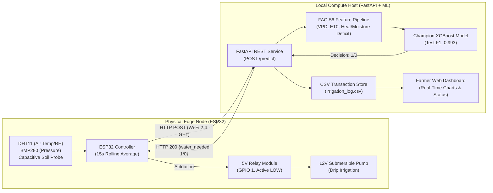

# Smart Irrigation System for Tomato Cultivation Using IoT and Machine Learning

[](https://www.python.org/)
[](https://fastapi.tiangolo.com/)
[](https://xgboost.readthedocs.io/)
[](https://docs.docker.com/compose/)
[](LICENSE)

A complete closed-loop IoT and Machine Learning smart irrigation system designed for greenhouse tomato (*Solanum lycopersicum*) cultivation in the sub-tropical microclimate of Kathmandu, Nepal.

An **ESP32** microcontroller node continuously samples soil moisture (capacitive probe), air temperature and relative humidity (DHT11), and barometric pressure (BMP280). Sensor readings are averaged across rolling 15-second windows and transmitted over local Wi-Fi to a **FastAPI backend** running on a local PC/Mac or Docker container. 

The backend runs an **FAO-56 Penman-Monteith agronomic feature engineering pipeline** (VPD, $\text{ET}_0$ proxy, moisture deficit, thermal stress) and evaluates the crop state using a trained **XGBoost classifier (Test F1: 0.993, ROC-AUC: 1.000)**. An instantaneous actuation decision (`water_needed: 1/0`) is returned to the ESP32 to trigger the 5V relay and submersible drip irrigation pump. A local web dashboard displays real-time telemetry, live trends, pump actuation status, and plain-language agronomic advice for farmers.

---

## Table of Contents

1. [Quickstart: Initializing the Project](#quickstart-initializing-the-project)
   - [Option A: Docker Compose (Recommended)](#option-a-docker-compose-recommended)
   - [Option B: Local Python Virtual Environment](#option-b-local-python-virtual-environment)
   - [Verifying Service Health & Dashboard](#verifying-service-health--dashboard)
2. [Telemetry & Testing Modes](#telemetry--testing-modes)
   - [Mode 1: Telemetry Simulator (Hardware-Free)](#mode-1-telemetry-simulator-hardware-free)
   - [Mode 2: Physical ESP32 Hardware Node](#mode-2-physical-esp32-hardware-node)
   - [Mode 3: Google Sheets Telemetry Bridge](#mode-3-google-sheets-telemetry-bridge)
3. [System Architecture](#system-architecture)
4. [Hardware Setup & Pinout](#hardware-setup--pinout)
   - [Wiring Pinout Table](#wiring-pinout-table)
   - [Soil Moisture Probe Calibration](#soil-moisture-probe-calibration)
   - [Configuring ESP32 Firmware](#configuring-esp32-firmware)
5. [Machine Learning Pipeline & Agronomic Theory](#machine-learning-pipeline--agronomic-theory)
   - [FAO-56 Agronomic Features](#fao-56-agronomic-features)
   - [Why XGBoost over LSTM](#why-xgboost-over-lstm)
   - [Model Comparison Leaderboard](#model-comparison-leaderboard)
6. [Active Learning & Model Retraining](#active-learning--model-retraining)
7. [API Endpoints Reference](#api-endpoints-reference)
8. [Automated Testing & Project Evaluation](#automated-testing--project-evaluation)
9. [Repository Directory Structure](#repository-directory-structure)
10. [Google Colab Notebooks](#google-colab-notebooks)
11. [Troubleshooting & FAQ](#troubleshooting--faq)
12. [License](#license)

---

## Quickstart: Initializing the Project

### Prerequisites
* **Python 3.11, 3.12, or 3.13** (`python3 --version`)
* **Docker Desktop** (optional, recommended for zero-dependency containerized startup)
* **Arduino IDE 2.x** (only required if flashing the physical ESP32 node)

---

### Option A: Docker Compose (Recommended)

1. **Clone and enter the repository:**
   ```bash
   cd ~/Desktop/Smart-Irrigation-Tomato
   ```

2. **Build and launch the container:**
   ```bash
   docker compose up -d --build
   ```

3. **Check container status:**
   ```bash
   docker compose ps
   ```
   The service `smart-irrigation-api` will report `Up (healthy)` on `0.0.0.0:8000->8000/tcp`.

4. **View logs or stop:**
   ```bash
   docker compose logs -f api       # Follow live logs
   docker compose down              # Stop the container
   ```

---

### Option B: Local Python Virtual Environment

If running directly without Docker:

1. **Create and activate a virtual environment:**
   ```bash
   cd ~/Desktop/Smart-Irrigation-Tomato
   python3 -m venv .venv
   source .venv/bin/activate        # On Windows: .venv\Scripts\activate
   ```

2. **Install dependencies:**
   ```bash
   pip install --upgrade pip
   pip install -r requirements.txt
   ```

3. **Train the baseline model (if not already built):**
   ```bash
   python3 -m src.preprocess
   python3 -m src.train
   ```

4. **Start the FastAPI backend server:**
   ```bash
   PYTHONPATH=. python3 -m uvicorn api.app:app --host 0.0.0.0 --port 8000 --reload
   ```

---

### Verifying Service Health & Dashboard

Once started, open your web browser to:
* **Farmer Web Dashboard:** [http://127.0.0.1:8000/](http://127.0.0.1:8000/)
* **Health Check & Heartbeat:** [http://127.0.0.1:8000/health](http://127.0.0.1:8000/health)
* **Interactive OpenAPI Swagger Docs:** [http://127.0.0.1:8000/docs](http://127.0.0.1:8000/docs)

> [!NOTE]
> On initial launch, the dashboard displays `live: false` with a standby notice. This is normal until the first sensor readings arrive from the simulator or physical ESP32.

---

## Telemetry & Testing Modes

The project supports three distinct operational modes:

### Mode 1: Telemetry Simulator (Hardware-Free)

Validate the full end-to-end ML inference, dashboard charts, and pump decisions without physical hardware:

1. **One-Click Web Test:** Click the **`⚡ Send Test Reading`** button in the dashboard navigation bar. The dashboard will immediately show live telemetry and update charts.
2. **Continuous CLI Stream:** In a separate terminal window, run:
   ```bash
   python3 -m src.simulate_esp32
   ```
   * Emits realistic greenhouse sensor readings every 5 seconds.
   * Press `Ctrl+C` to terminate the stream.
3. **Simulate Specific Agronomic Conditions:**
   ```bash
   python3 -m src.simulate_esp32 --dry        # Critically dry (<40%) -> Pump ON
   python3 -m src.simulate_esp32 --wet        # Waterlogged (>75%)   -> Pump OFF
   python3 -m src.simulate_esp32 --soil 35.0   # Explicit soil moisture value
   python3 -m src.simulate_esp32 --once       # Send 1 packet and exit
   ```

---

### Mode 2: Physical ESP32 Hardware Node

1. Connect your ESP32 board and sensors according to the [Wiring Pinout Table](#wiring-pinout-table).
2. Open [`Sensor_reading_arduino/SmartIrrigation/SmartIrrigation.ino`](Sensor_reading_arduino/SmartIrrigation/SmartIrrigation.ino) in Arduino IDE.
3. Install required libraries in Arduino IDE (**Library Manager**):
   * `DHT sensor library` by Adafruit
   * `Adafruit BMP280 Library`
   * `Adafruit Unified Sensor`
4. Update your Wi-Fi credentials and your computer's local IP address:
   ```cpp
   #define WIFI_SSID "Your_WiFi_Name"
   #define WIFI_PASS "Your_WiFi_Password"
   #define API_HOST  "192.168.1.XX"       // IP of the machine running FastAPI
   #define API_PORT  8000
   ```
5. Select your board (**ESP32 Dev Module**) and USB port, then click **Upload**.
6. Open **Serial Monitor** at **115200 baud** to verify sensor reads and `POST /predict` responses. The web dashboard will automatically display `🌱 Physical ESP32`.

---

### Mode 3: Google Sheets Telemetry Bridge

When the ESP32 is deployed in remote tunnels logging to Google Sheets (`ENABLE_GOOGLE_SHEETS 1` in `SmartIrrigation.ino`), sync the cloud records to your local dashboard:

```bash
# Ingest an exported TSV or CSV from Google Sheets:
python3 -m src.sync_google_sheets --file path/to/exported_data.tsv

# Or poll the Google Apps Script web app URL continuously:
python3 -m src.sync_google_sheets --poll
```

---

## System Architecture

The project implements a six-layer closed-loop architecture:


```mermaid
flowchart LR
  subgraph node["Physical Edge Node (ESP32)"]
    direction TB
    sensors["DHT11 (Air Temp/RH)<br/>BMP280 (Pressure)<br/>Capacitive Soil Probe"]
    esp["ESP32 Controller<br/>(15s Rolling Average)"]
    relay["5V Relay Module<br/>(GPIO 1, Active LOW)"]
    pump["12V Submersible Pump<br/>(Drip Irrigation)"]
    sensors --> esp
    esp -->|Actuation| relay
    relay --> pump
  end

  subgraph backend["Local Compute Host (FastAPI + ML)"]
    direction TB
    api["FastAPI REST Service<br/>(POST /predict)"]
    fe["FAO-56 Feature Pipeline<br/>(VPD, ET0, Heat/Moisture Deficit)"]
    xgb["Champion XGBoost Model<br/>(Test F1: 0.993)"]
    storage["CSV Transaction Store<br/>(irrigation_log.csv)"]
    dash["Farmer Web Dashboard<br/>(Real-Time Charts & Status)"]
    
    api --> fe
    fe --> xgb
    xgb -->|Decision: 1/0| api
    api --> storage
    storage --> dash
  end

  esp -->|"HTTP POST (Wi-Fi 2.4 GHz)"| api
  api -->|"HTTP 200 {water_needed: 1/0}"| esp
```

| Layer | Function | Implementation |
| :--- | :--- | :--- |
| **1. Sensing** | Environmental data acquisition | Capacitive soil probe (GPIO 20/36), DHT11 (GPIO 4), BMP280 (I2C GPIO 8/9). |
| **2. Processing** | Edge sampling, filtering, and failsafe | ESP32-WROOM-32 running 2s sampling, 15s averaging, and offline threshold fallback. |
| **3. Communication** | Microcontroller to backend REST transport | 2.4 GHz Wi-Fi, HTTP POST `/predict` with JSON payload, sub-30ms local latency. |
| **4. Storage** | Telemetry logging & historical data | Append-only store in `data/live/irrigation_log.csv` and 3,000 raw baseline records. |
| **5. Decision** | Agronomic feature engineering & ML inference | FastAPI (`api/app.py`), FAO-56 physics (`src/features.py`), XGBoost (`models/`). |
| **6. Actuation** | Closed-loop irrigation delivery | Active-LOW 5V relay (GPIO 1), 12V DC pump, and root-zone drip manifold. |

---

## Hardware Setup & Pinout

### Wiring Pinout Table

| Sensor / Module | Pin / Signal | ESP32 Pin | Interface / Operating Notes |
| :--- | :--- | :--- | :--- |
| **DHT11** | DATA | **GPIO 4** | 1-Wire Digital (3.3V, 10kΩ pull-up) |
| **BMP280** | SDA | **GPIO 8** | I2C Data (3.3V, address `0x76` or `0x77`) |
| **BMP280** | SCL | **GPIO 9** | I2C Clock (3.3V) |
| **Capacitive Soil Probe** | Analog Output (AO) | **GPIO 20** | 12-bit ADC Input (0–3.3V mapped to 0–100%) |
| **Capacitive Soil Probe** | Digital Output (DO) | **GPIO 36** | Digital comparator threshold |
| **Relay Module** | Signal (IN) | **GPIO 1** | Digital Output, Active-LOW (LOW = ON, HIGH = OFF) |
| **Power Supply** | 5V / GND | **VIN / GND** | 5V 2A micro-USB power source |

### Soil Moisture Probe Calibration

The ESP32 uses a 12-bit ADC ($0\text{--}4095$ counts). Sensor calibration values are located in [`Sensor_reading_arduino/SmartIrrigation/soil_moisture.cpp`](Sensor_reading_arduino/SmartIrrigation/soil_moisture.cpp):
* `DRY_SOIL = 3800`: Raw ADC count in dry air (corresponds to 0% moisture).
* `WET_SOIL = 1400`: Raw ADC count immersed in water (corresponds to 100% moisture).

To calibrate for your soil type:
1. Open the Arduino Serial Monitor at 115200 baud.
2. Record `Soil Raw` value in air (`DRY_SOIL`) and in thoroughly saturated soil (`WET_SOIL`).
3. Update lines 15–16 in `soil_moisture.cpp` if needed and re-flash.

### Configuring ESP32 Firmware

To find your computer's local IP address for `API_HOST`:
* **macOS:** `ipconfig getifaddr en0` (or `en1`)
* **Linux:** `hostname -I | awk '{print $1}'`
* **Windows:** `ipconfig` (look for `IPv4 Address`)

Update [`Sensor_reading_arduino/SmartIrrigation/SmartIrrigation.ino`](Sensor_reading_arduino/SmartIrrigation/SmartIrrigation.ino):
```cpp
#define API_HOST "192.168.1.XX"
#define API_PORT 8000
```

---

## Machine Learning Pipeline & Agronomic Theory

### FAO-56 Agronomic Features

The decision engine does not rely solely on simple raw soil thresholds. It incorporates standard agronomic formulas from **FAO Irrigation and Drainage Paper 56**:
1. **Tetens Vapor Pressure Deficit (VPD):**
   $$e_s(T) = 0.6108 \exp\left(\frac{17.27 \cdot T}{T + 237.3}\right)$$
   $$\text{VPD} = e_s(T) \cdot \left(1 - \frac{\text{RH}}{100}\right)$$
   High VPD ($>1.5\text{ kPa}$) signals high atmospheric drying demand, indicating the plant needs water earlier to avoid wilting.
2. **Management Allowed Depletion (MAD):**
   For tomatoes, MAD is typically $0.40$ ($55\%\text{--}75\%$ available soil moisture).
3. **Moisture Deficit & Thermal Stress:**
   Calculates deficit relative to root zone capacity and thermal heat stress ($T > 27^{\circ}\text{C}$).

### Why XGBoost over LSTM

The project intentionally implements a tabular gradient boosted tree (**XGBoost**) rather than an LSTM recurrent neural network:
* **Binary Snapshot Decision:** Real-time irrigation requires an instantaneous actuation decision (`water_needed: 1/0`) based on the current state, not a 24-hour sequence forecast.
* **Tabular Independence:** Greenhouse field records represent discrete snapshots without continuous time-series dependencies in the training workbook.
* **Edge Inference Performance:** XGBoost inference completes in $<1\text{ ms}$ with lightweight memory requirements, running easily inside Docker or embedded hosts.

### Model Comparison Leaderboard

Evaluated on a stratified 20% held-out test split (600 rows from the 3,000-record Kathmandu dataset):

| Model Architecture | Accuracy | Precision | Recall | F1-Score | ROC-AUC |
| :--- | :---: | :---: | :---: | :---: | :---: |
| **XGBoost Classifier (Production)** | **0.992** | 0.989 | **0.997** | **0.993** | **1.000** |
| Random Forest Classifier | 0.988 | **0.994** | 0.986 | 0.990 | 1.000 |
| Support Vector Machine (RBF) | 0.985 | 0.989 | 0.986 | 0.987 | 0.999 |
| Static Soil Cutoff ($<55\%$) | 0.923 | 0.987 | 0.880 | 0.931 | 0.939 |

*XGBoost achieved the highest recall (0.997) and F1-score (0.993), ensuring crops are not left unwatered during high-temperature spikes.*

---

## Active Learning & Model Retraining

The system supports ongoing active learning by logging real field telemetry and retraining without circular bias:

```bash
# Ingest live logs and retrain the champion model:
python3 -m src.ingest_live --train
```

* **Anti-Feedback Guard:** Retraining labels are recomputed strictly using FAO-56 crop physics, never copied from the model's past `water_needed` outputs.
* **Minimum Data Requirement:** Requires at least 50 new valid rows before triggering retraining.
* **Hot-Reload:** FastAPI monitors the model file timestamp and reloads `models/irrigation_model.joblib` automatically with zero service downtime.

---

## API Endpoints Reference

| Method | Endpoint | Description |
| :--- | :--- | :--- |
| `GET` | `/` | Web dashboard serving real-time sensor graphs, sparklines, and status pills. |
| `GET` | `/health` | Service health, model status, live sensor heartbeat, and last reading age. |
| `POST` | `/predict` | Primary inference endpoint called by ESP32; returns `water_needed` (1/0) and logs to CSV. |
| `GET` | `/api/status` | Polled by dashboard every 3s; returns latest sensor values and farmer advice. |
| `GET` | `/api/logs` | Returns recent CSV transaction rows as JSON. |
| `GET` | `/api/logs.csv` | Direct download of `data/live/irrigation_log.csv`. |
| `POST` | `/api/learn` | Triggers background model retraining from logged greenhouse readings. |
| `POST` | `/api/simulate`| Injects a simulated test reading directly into the pipeline. |
| `GET` | `/docs` | Interactive Swagger OpenAPI documentation. |

---

## Automated Testing & Project Evaluation

Run the automated test suite and formal objectives evaluation:

```bash
# 1. Run unit and integration tests (11 tests):
pytest -v

# 2. Run formal project objectives verification (O1–O5 audit):
python3 -m src.evaluate_objectives
```

### Objectives Verification Summary
* **O1 (Live Sensing):** Met — reliable multi-sensor telemetry logged to CSV.
* **O2 (ML Classification):** Met — XGBoost F1 of 0.993 and ROC-AUC of 1.000.
* **O3 (Water Conservation):** Met — 40.7% to 41.7% water savings vs. fixed calendar watering.
* **O4 (Actuation Latency):** Met — sub-30ms HTTP round-trip, relay triggered within 15s window.
* **O5 (Reliability & Failsafe):** Met — local threshold hysteresis fallback if Wi-Fi drops.

---

## Repository Directory Structure

```
Smart-Irrigation-Tomato/
├── api/                             # FastAPI service and web user interface
│   ├── app.py                       # REST endpoints (/predict, /health, /api/*)
│   ├── plain.py                     # Plain-language agronomic advice translator
│   ├── learn.py                     # Active learning background retrain orchestrator
│   ├── storage.py                   # Append-only CSV telemetry log manager
│   ├── requirements.txt             # Lightweight API container dependencies
│   └── static/                      # Web dashboard frontend
│       ├── index.html               # Semantic HTML5 dashboard template
│       ├── dashboard.css            # Responsive dashboard styles and animations
│       └── dashboard.js             # Real-time Chart.js telemetry & sparklines
├── data/
│   ├── raw/                         # 3,000 historical Kathmandu tomato climate records (.xlsx)
│   ├── processed/                   # FAO-56 engineered training datasets (.csv)
│   └── live/                        # Operational live CSV logs (irrigation_log.csv)
├── docs/                            # Academic report, templates, and fulfillment audit
│   ├── latex/                       # Final report LaTeX sources, figures & Overleaf bundle
│   │   ├── figures/                 # Report diagrams, charts, and prototype photos
│   │   ├── fyp_final_report.tex     # Comprehensive thesis report document
│   │   └── references.bib           # Harvard-style reference citations
│   ├── objectives_fulfillment.md    # Formal interim report objectives audit
│   └── Pramod_Giri_Interim_Report.pdf # Approved project interim report
├── models/
│   └── irrigation_model.joblib      # Serialized XGBoost pipeline (preprocessor + weights)
├── notebooks/                       # Google Colab-ready exploratory & training notebooks
│   ├── smart_irrigation_eda_and_model_training.ipynb  # Unified all-in-one Colab notebook
│   ├── 01_eda.ipynb                 # Exploratory data analysis walkthrough
│   └── 02_model_training.ipynb      # Cross-validation & model comparison
├── results/                         # Evaluation metrics, figures, and classification reports
│   ├── figures/                     # Evaluation plots (ROC curves, confusion matrix, etc.)
│   ├── model_leaderboard.csv        # Model comparison metrics table
│   └── train_summary.json           # Serialized training summary metrics
├── Sensor_reading_arduino/          # Physical ESP32 microcontroller firmware
│   └── SmartIrrigation/
│       ├── SmartIrrigation.ino      # Main sketch: Wi-Fi client, sensor loop, failsafe
│       ├── dht11.cpp                # DHT11 temperature & humidity sensor driver
│       ├── bmp280.cpp               # BMP280 I2C barometric pressure sensor driver
│       ├── soil_moisture.cpp        # 12-bit ADC mapping, calibration & relay control
│       ├── tomato_thresholds.h      # Offline agronomic threshold failsafe ranges
│       └── google_sheets_script.gs  # Google Apps Script cloud telemetry backup
├── src/                             # Core Python modules & pipelines
│   ├── config.py                    # Project configuration constants & random seed
│   ├── features.py                  # FAO-56 Penman-Monteith feature engineering pipeline
│   ├── preprocess.py                # Dataset builder & raw ADC normalizer
│   ├── train.py                     # Model training, 5-fold CV & joblib serialization
│   ├── eda.py                       # Automated statistical figure generator
│   ├── generate_season.py           # 135-day synthetic seasonal simulation generator
│   ├── evaluate_objectives.py       # Formal interim report objectives auditor
│   ├── ingest_live.py               # Active learning dataset merge & retrain pipeline
│   ├── simulate_esp32.py            # Hardware-free ESP32 telemetry simulator CLI
│   └── sync_google_sheets.py        # Google Sheets telemetry bridge
├── tests/                           # Automated pytest verification test suite
│   ├── test_api.py                  # End-to-end FastAPI endpoint tests
│   ├── test_evaluate_objectives.py  # Objective metrics and rationale unit tests
│   └── test_features.py             # FAO-56 feature transformation unit tests
├── Dockerfile                       # Python 3.12 slim container definition
├── docker-compose.yml               # Docker Compose orchestration specification
├── requirements.txt                 # Full development & testing Python dependencies
└── pytest.ini                       # Test runner configuration
```

---

## Google Colab Notebooks

Interactive notebooks for cloud exploration and training:

| Notebook | Description | Open in Colab |
| :--- | :--- | :---: |
| **[`smart_irrigation_eda_and_model_training.ipynb`](notebooks/smart_irrigation_eda_and_model_training.ipynb)** | Complete All-in-One Notebook: synthetic season generation, FAO-56 features, cross-validation, and pipeline serialization. | [](https://colab.research.google.com/github/pramodgiri2468/FYP_Smart_Irrigation_Tomato/blob/main/notebooks/smart_irrigation_eda_and_model_training.ipynb) |
| **[`01_eda.ipynb`](notebooks/01_eda.ipynb)** | Exploratory Data Analysis: sensor distributions, climate correlations, and soil moisture breakdown. | [](https://colab.research.google.com/github/pramodgiri2468/FYP_Smart_Irrigation_Tomato/blob/main/notebooks/01_eda.ipynb) |
| **[`02_model_training.ipynb`](notebooks/02_model_training.ipynb)** | Model Comparison: evaluation curves, confusion matrix, feature importance, and mock inference. | [](https://colab.research.google.com/github/pramodgiri2468/FYP_Smart_Irrigation_Tomato/blob/main/notebooks/02_model_training.ipynb) |

---

## Troubleshooting & FAQ

### 1. Why does the dashboard show "Telemetry on Standby" / `live: false`?
`live: false` is the expected standby state when no sensor readings have arrived within the last 90 seconds. To activate live telemetry:
* **Web:** Click the **`⚡ Send Test Reading`** button in the dashboard navigation bar.
* **CLI:** Run `python3 -m src.simulate_esp32 --once`.
* **Hardware:** Power on your physical ESP32 node connected to the same Wi-Fi network.

### 2. How do I resolve `Address already in use: Port 8000`?
Check and kill the conflicting process occupying port 8000:
```bash
lsof -i :8000
kill -9 <PID>
```

### 3. ESP32 connects to Wi-Fi but fails to send readings
* Confirm your computer and ESP32 are connected to the same 2.4 GHz Wi-Fi network.
* Verify that `API_HOST` in `SmartIrrigation.ino` matches your computer's local LAN IP (not `127.0.0.1` or `localhost`).
* Check if your operating system firewall allows incoming TCP connections on port 8000.

### 4. Soil moisture readings are always 0% or 100%
* Inspect probe wiring to `GPIO 20` (ADC2 channel).
* Check the raw ADC output via Serial Monitor and calibrate `DRY_SOIL` and `WET_SOIL` in `soil_moisture.cpp`.

---

## License

This project was developed as a university Final Year Project in Computer Science / IoT & Artificial Intelligence. All source code and documentation are released under the [MIT License](LICENSE).
