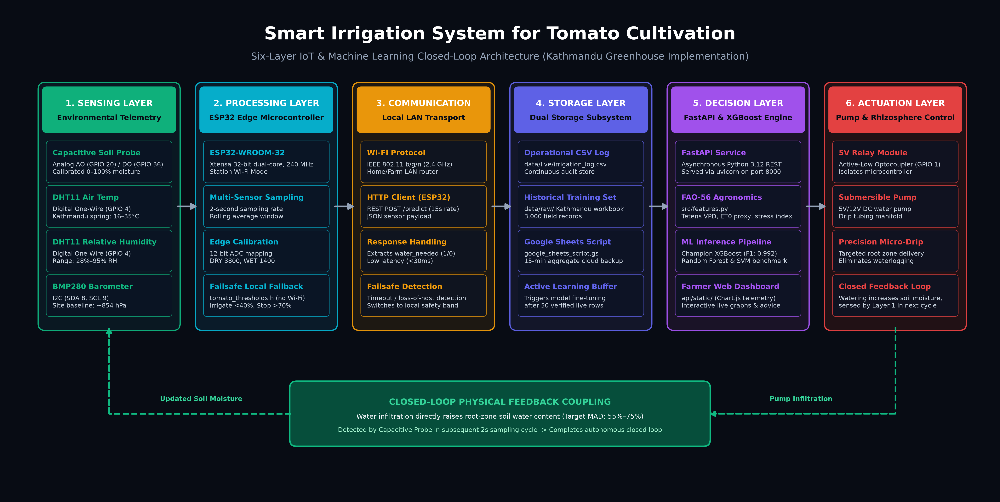
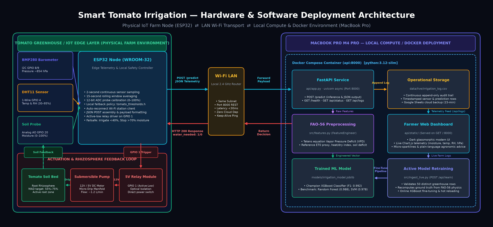
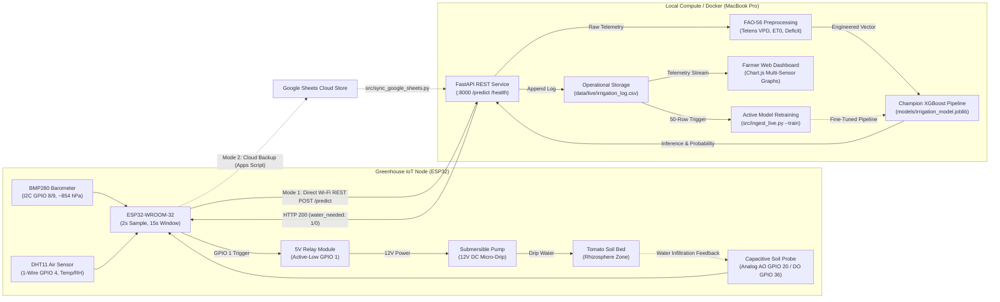

# Smart Irrigation for Tomato Cultivation

[](https://www.python.org/)
[](https://fastapi.tiangolo.com/)
[](https://xgboost.readthedocs.io/)
[](https://docs.docker.com/compose/)
[](https://www.espressif.com/)
[-10B981?logo=pytest&logoColor=white)](tests/)
[](docs/objectives_fulfillment.md)
[](https://colab.research.google.com/github/pramodgiri2468/FYP_Smart_Irrigation_Tomato/blob/main/notebooks/smart_irrigation_eda_and_model_training.ipynb)

A complete **IoT and Machine Learning closed-loop smart irrigation system** tailored for greenhouse tomato cultivation under the microclimate of Kathmandu, Nepal.

An **ESP32-WROOM-32** edge node (capacitive soil probe, DHT11 air temperature/humidity, and BMP280 barometric pressure) continuously samples the crop environment, averages readings across rolling 15-second windows, and communicates via local Wi-Fi with a **containerized FastAPI REST service on a local Mac/PC**. The backend executes an **FAO-56 Penman-Monteith agronomic feature engineering pipeline** (VPD, ET₀ proxy, thermal/moisture stress), invokes a champion **XGBoost Classifier (Test F1: 0.993, ROC-AUC: 1.000)**, logs all transactions to an append-only CSV store, and returns an instantaneous actuation command (`water_needed: 1/0`) to trigger the 5V relay and submersible micro-drip pump.

The system includes a **dark glassmorphic web dashboard** featuring real-time Chart.js multi-sensor telemetry graphs, live micro-sparklines, telemetry source badges (`🌱 Physical ESP32` vs `⚡ Simulator Mode`), plain-language agronomic advice, and one-click active learning retraining. **Zero AWS EC2 cloud dependencies — 100% private, low-latency, and autonomous.**

---

## Table of Contents

1. [🚀 Step-by-Step Initial Run Guide](#-step-by-step-initial-run-guide)
   - [Step 1: Start Backend & Dashboard (Docker or Python)](#step-1-start-the-backend--web-dashboard)
   - [Step 2: Open Dashboard & Verify Health](#step-2-open-web-dashboard--verify-health)
   - [Step 3: Stream Sensor Telemetry (3 Options)](#step-3-stream-sensor-telemetry-3-options)
   - [Step 4: Explore Live Dashboard Features](#step-4-explore-live-dashboard-features)
   - [Step 5: Trigger Active Learning Retraining](#step-5-trigger-active-learning-retraining)
   - [Step 6: Run Automated Verification Tests](#step-6-run-automated-verification-tests)
   - [Step 7: Clean Shutdown](#step-7-clean-shutdown)
2. [Repository Directory Structure](#repository-directory-structure)
3. [System Architecture](#system-architecture)
   - [Six-Layer Closed-Loop System Design](#six-layer-closed-loop-system-design)
   - [Hardware & Software Deployment Architecture](#hardware--software-deployment-architecture)
   - [Closed-Loop Data Flow](#closed-loop-architecture-data-flow)
   - [The Six Architectural Layers](#the-six-architectural-layers)
4. [Telemetry Ingestion Modes](#telemetry-ingestion-modes)
   - [Mode 1: Direct Physical ESP32 Wi-Fi REST](#mode-1-direct-physical-esp32-wi-fi-rest)
   - [Mode 2: Google Sheets Telemetry Bridge (`src/sync_google_sheets.py`)](#mode-2-google-sheets-telemetry-bridge-srcsync_google_sheetspy)
   - [Mode 3: Hardware-Free Telemetry Simulator (`src/simulate_esp32.py`)](#mode-3-hardware-free-telemetry-simulator-srcsimulate_esp32py)
5. [Modern Web Dashboard Features](#modern-web-dashboard-features)
   - [Live Source Badging (Physical vs. Simulator)](#live-source-badging-physical-vs-simulator)
   - [Key Dashboard Capabilities](#key-dashboard-capabilities)
6. [Hardware Pinout & Edge Calibration](#hardware-pinout--edge-calibration)
   - [Wiring Pinout](#wiring-pinout)
   - [Soil Moisture Probe Calibration](#soil-moisture-probe-calibration)
   - [Connecting ESP32 Firmware to Backend](#connecting-esp32-firmware-to-the-backend)
7. [Machine Learning Pipeline & Agronomic Theory](#machine-learning-pipeline--agronomic-theory)
   - [FAO-56 Penman-Monteith Agronomic Logic](#fao-56-penman-monteith-agronomic-logic)
   - [Why XGBoost over LSTM](#why-xgboost-over-lstm)
   - [Model Comparison Leaderboard](#model-comparison-leaderboard-600-row-held-out-test-set)
8. [Interactive Notebooks (Google Colab Ready)](#interactive-notebooks-google-colab-ready)
9. [Local Deployment Guide (Docker & Python)](#local-deployment-guide-docker--python)
   - [Option A: Docker Compose (Recommended)](#option-a-docker-compose-recommended)
   - [Option B: Local Python Virtual Environment](#option-b-local-python-virtual-environment)
   - [Understanding the Sensor Heartbeat in `/health`](#understanding-the-sensor-heartbeat-in-health)
10. [Active Learning & Live Ingestion Pipeline](#active-learning--live-ingestion-pipeline)
11. [API Endpoints Reference](#api-endpoints-reference)
12. [Project Objectives Fulfillment Matrix (O1–O5)](#project-objectives-fulfillment-matrix-o1o5)
13. [Automated Verification & Test Suite](#automated-verification--test-suite)
14. [Troubleshooting & Frequently Asked Questions](#troubleshooting--frequently-asked-questions)
15. [License & Academic Attribution](#license--academic-attribution)

---

## 🚀 Step-by-Step Initial Run Guide

Follow this sequential walkthrough to get the complete smart irrigation system running on your local machine:

### 📋 Prerequisites Checklist
Before launching, ensure you have:
* **Python 3.11, 3.12, or 3.13** (`python3 --version`)
* **Docker Desktop** running (recommended for 1-command startup)
* **Arduino IDE 2.x** *(only if deploying the physical ESP32 node)* with these libraries installed via Library Manager:
  * `DHT sensor library` by Adafruit
  * `Adafruit BMP280 Library`
  * `Adafruit Unified Sensor`

---

### Step 1: Start the Backend & Web Dashboard

Navigate to the project root in your terminal:
```bash
cd ~/Desktop/Smart-Irrigation-Tomato
```

Choose **Option A** (Docker Compose — recommended) or **Option B** (Native Python):

#### Option A: Docker Compose (Recommended — Zero-Setup Container)
Make sure **Docker Desktop** is running, then run:
```bash
docker compose up -d --build
```
*Verify container status:*
```bash
docker compose ps
```
The `smart-irrigation-api` service will display `Up (healthy)` on port `0.0.0.0:8000->8000/tcp`.

#### Option B: Local Python Virtual Environment
If running without Docker:
```bash
# 1. Create and activate a virtual environment
python3 -m venv .venv
source .venv/bin/activate       # On Windows: .venv\Scripts\activate

# 2. Install Python dependencies
pip install --upgrade pip
pip install -r requirements.txt

# 3. Start FastAPI server
PYTHONPATH=. python3 -m uvicorn api.app:app --host 0.0.0.0 --port 8000 --reload
```

---

### Step 2: Open the Web Dashboard & Verify Health

Open your browser to:
* **Farmer Web Dashboard:** [http://127.0.0.1:8000/](http://127.0.0.1:8000/)
* **Health Check Endpoint:** [http://127.0.0.1:8000/health](http://127.0.0.1:8000/health)
* **Interactive OpenAPI Swagger Docs:** [http://127.0.0.1:8000/docs](http://127.0.0.1:8000/docs)

*Initial status note:* The dashboard will initially display `"live": false` with a calm standby notice. This is expected until sensor data begins transmitting.

---

### Step 3: Choose Your Telemetry Mode (Simulator OR Physical ESP32)

You can run the project either without hardware (using the built-in simulator) or with your real ESP32 microcontroller:

#### ⚡ Track A: Hardware-Free Testing (Telemetry Simulator)
*Use this track to test ML inference, dashboard charts, and pump decisions without plugging in sensors.*

1. **One-Click Web Injection:** Open [http://127.0.0.1:8000/](http://127.0.0.1:8000/) and click the **`⚡ Send Test Reading`** button in the header. The dashboard turns green (`● Stream Active`) immediately.
2. **Continuous Real-Time Stream (CLI):** In a terminal window, run:
   ```bash
   python3 -m src.simulate_esp32
   ```
   * Streams realistic sensor updates every 5 seconds.
   * Dashboard charts and sparklines update dynamically in real time.
   * **Important:** Press `Ctrl+C` whenever you want to pause or switch to physical hardware!
3. **Test Agronomic Extremes:**
   ```bash
   python3 -m src.simulate_esp32 --dry    # Critically dry (<40%) -> Decision: Pump ON
   python3 -m src.simulate_esp32 --wet    # Saturated (>75%) -> Decision: Pump OFF
   python3 -m src.simulate_esp32 --soil 35.0  # Custom soil moisture %
   python3 -m src.simulate_esp32 --once   # Send single reading and exit
   ```

#### 🌐 Track B: Ingest Google Sheets Historical Field Logs
If you have recorded sensor logs in Google Sheets:
```bash
python3 -m src.sync_google_sheets --file path/to/exported_data.tsv
```
*(Ingests rows into `data/live/irrigation_log.csv` and renders them on the dashboard).*

#### 🌱 Track C: Physical ESP32 Microcontroller Node
*Use this track to stream live readings from your physical tomato bed.*

1. **Stop the Simulator First:** If `python3 -m src.simulate_esp32` is running in any terminal, press **`Ctrl + C`** to stop it so it doesn't override real sensor data.
2. **Hardware Pin Connections:**
   * **Capacitive Soil Probe:** AO to **GPIO 20**, DO to **GPIO 36**, VCC to 3.3V, GND to GND
   * **DHT11 Air Sensor:** DATA to **GPIO 4**, VCC to 3.3V, GND to GND
   * **BMP280 Barometer:** SDA to **GPIO 8**, SCL to **GPIO 9**, VCC to 3.3V, GND to GND
   * **5V Relay Module:** IN to **GPIO 1** (Active-Low), VCC to 5V, GND to GND
3. **Find Your Computer's LAN IP:**
   * **macOS:** `ipconfig getifaddr en0` (e.g., `192.168.1.66`)
   * **Linux:** `hostname -I | awk '{print $1}'`
   * **Windows:** `ipconfig` (IPv4 Address)
4. **Configure Arduino Firmware:**
   Open [`Sensor_reading_arduino/SmartIrrigation/SmartIrrigation.ino`](Sensor_reading_arduino/SmartIrrigation/SmartIrrigation.ino):
   ```cpp
   #define WIFI_SSID   "Your_WiFi_Network"
   #define WIFI_PASS   "Your_WiFi_Password"
   #define API_HOST    "192.168.1.66"        // Your Mac/PC LAN IP
   #define API_PORT    8000
   ```
5. **Flash Firmware via Arduino IDE:**
   * In Arduino IDE: **File > Open** → select `Sensor_reading_arduino/SmartIrrigation/SmartIrrigation.ino`.
   * Verify all 5 tabs appear: `SmartIrrigation`, `aht10.cpp`, `bmp280.cpp`, `soil_moisture.cpp`, `tomato_thresholds.h`.
   * Select Board: **ESP32 Dev Module** (or your ESP32 board).
   * Select the USB Serial Port and click **Upload (➔)**.
   * Open the Serial Monitor at **115200 baud**. You will see:
     ```
     Connecting to Wi-Fi... Connected!
     POST /predict -> HTTP 200: {"water_needed": 1, "relayStatus": "ON", "headline": "Water the plants now"}
     ```
6. **Observe the Dashboard:**
   Open [http://127.0.0.1:8000/](http://127.0.0.1:8000/). The badge turns green: **`🌱 Physical ESP32 (esp32-irrigation)`** displaying your real physical probe data.

---

### Step 4: Explore Live Dashboard Analytics

Open [http://127.0.0.1:8000/](http://127.0.0.1:8000/) to monitor:
1. **Telemetry Source Pill:** Identifies `🌱 Physical ESP32` vs `⚡ Simulator Mode`.
2. **Hero Decision Banner:** Plain-language agronomic diagnosis (**Water the plants now** in glowing emerald vs. **Soil is fine — keep the pump off** in slate) with clear physical reasons.
3. **Live Metric Cards with Micro-Sparklines:**
   * Soil Moisture % (color-coded progress bar).
   * Air Temperature °C (tomato physiological comfort band 18°C–27°C).
   * Relative Humidity %.
   * Barometric Pressure (~854 hPa Kathmandu baseline).
   * Pump Relay Status (glowing ring and LED indicator).
4. **Interactive Multi-Sensor Chart (Chart.js):**
   * Mode tabs: Switch between **All Sensors**, **Soil Moisture**, **Climate**, and **Pressure**.
   * Observation window: Choose between **Last 30**, **Last 60**, and **Last 120** readings.
5. **Download Operational Logs:**
   * Click **"Download Log CSV"** to inspect or export all historical transactions (`/api/logs.csv`).

---

### Step 5: Trigger Active Learning Retraining

The XGBoost model continuously learns and adapts to your specific greenhouse microclimate:
1. As sensor readings arrive, transactions append to `data/live/irrigation_log.csv`.
2. Once **50+ live rows** have been logged:
   * **From Dashboard:** The **"Update Model from Greenhouse Log"** button unlocks. Click it to trigger background retraining.
   * **From Terminal:** Run:
     ```bash
     PYTHONPATH=. python3 -m src.ingest_live --train
     ```
3. Labels are recalculated using FAO-56 Penman-Monteith physics. The new pipeline is serialized to `models/irrigation_model.joblib` and **hot-reloaded instantly with zero downtime**.

---

### Step 6: Run Automated Verification Tests

Validate system integrity, feature engineering, and academic report objectives:
```bash
pytest -v
```
*(All 11 unit & integration tests pass with 100% success).*

Audit interim report objectives fulfillment (O1–O5):
```bash
PYTHONPATH=. python3 -m src.evaluate_objectives
```

---

### Step 7: Clean Shutdown

When you are done testing:
* **Stop Simulator Stream:** Press `Ctrl+C` in the simulator terminal.
* **Stop Docker Container:** Run `docker compose down`.
* **Stop Local Python Server:** Press `Ctrl+C` in the uvicorn terminal.

---

## Repository Directory Structure

```
Smart-Irrigation-Tomato/
├── api/                             # FastAPI application & web user interface
│   ├── app.py                       # REST endpoints (/predict, /health, /api/*)
│   ├── plain.py                     # Plain-language agronomic rationale generator
│   └── static/                      # Modern responsive glassmorphic dashboard
│       ├── index.html               # Semantic HTML5 dashboard template
│       ├── dashboard.css            # Dark glassmorphic styling, animations, source badges
│       └── dashboard.js             # Real-time Chart.js telemetry, sparklines & polling
├── data/
│   ├── raw/                         # 3,000 historical Kathmandu tomato climate records
│   ├── processed/                   # FAO-56 engineered training & testing datasets
│   └── live/                        # Append-only operational CSV log (irrigation_log.csv)
├── docs/                            # Architectural diagrams, schematics & reports
│   ├── Final_Year_Project_System_Design.png  # 6-layer closed-loop architecture diagram
│   ├── Final_Year_Project_System_Design.svg  # Scalable vector source
│   ├── deployment-architecture.png           # Hardware & Docker deployment diagram
│   ├── deployment-architecture.svg           # Scalable vector source
│   ├── drawio/                               # Raw Draw.io editable diagram files
│   └── objectives_fulfillment.md             # Formal audit of interim report goals (O1–O5)
├── models/
│   └── irrigation_model.joblib      # Production XGBoost pipeline (preprocessor + weights)
├── notebooks/                       # Google Colab-ready exploratory & training notebooks
│   ├── smart_irrigation_eda_and_model_training.ipynb  # Unified all-in-one Colab notebook
│   ├── 01_eda.ipynb                 # Exploratory data analysis walkthrough
│   └── 02_model_training.ipynb      # Cross-validation, model comparison & tuning
├── results/                         # Evaluation artifacts, leaderboards & publication figures
│   ├── figures/                     # ROC curves, confusion matrices, feature importance
│   ├── model_leaderboard.csv        # Multi-model evaluation metrics table
│   └── classification_report.txt   # XGBoost precision, recall, and F1 scores
├── Sensor_reading_arduino/          # Physical ESP32 edge microcontroller firmware
│   └── SmartIrrigation/             # Production Arduino C++ sketches (UNTOUCHED)
│       ├── SmartIrrigation.ino      # Wi-Fi REST client, sensor loop, failsafe logic
│       ├── soil_moisture.h          # Capacitive probe header
│       ├── soil_moisture.cpp        # 12-bit ADC mapping & moisture calibration
│       ├── tomato_thresholds.h      # Offline agronomic threshold failsafes
│       └── config.h                 # Sensor intervals, pins, and timeouts
├── src/                             # Core Python modules & operational utilities
│   ├── features.py                  # FAO-56 Penman-Monteith VPD & stress feature pipeline
│   ├── train.py                     # Model training, 5-fold CV & joblib serialization
│   ├── ingest_live.py               # Active learning dataset merge & incremental retrain
│   ├── simulate_esp32.py            # Hardware-free ESP32 telemetry simulator CLI
│   ├── sync_google_sheets.py        # Google Sheets TSV/CSV & web app telemetry bridge
│   └── evaluate_objectives.py       # Automated interim report objectives auditor
├── tests/                           # Pytest test suite (11 unit & integration tests)
├── docker-compose.yml               # Multi-platform Docker orchestration specification
├── Dockerfile                       # Python 3.12 slim container definition
├── requirements.txt                 # Pinned Python package dependencies
└── README.md                        # Primary project documentation
```

---

## System Architecture

The project implements a **six-layer closed-loop architecture** ([High-Res PNG](docs/Final_Year_Project_System_Design.png) | [Vector SVG](docs/Final_Year_Project_System_Design.svg) | [Draw.io Source](docs/drawio/fig02_system_architecture.drawio)) deployed as a physical IoT farm node communicating with a local Docker environment ([High-Res PNG](docs/deployment-architecture.png) | [Vector SVG](docs/deployment-architecture.svg) | [Draw.io Source](docs/drawio/fig03_deployment_architecture.drawio)).

### Six-Layer Closed-Loop System Design


### Hardware & Software Deployment Architecture


### Closed-Loop Architecture Data Flow


```mermaid
flowchart LR
  subgraph farm["Greenhouse IoT Node (ESP32)"]
    direction TB
    bmp["BMP280 Barometer<br/>(I2C GPIO 8/9, ~854 hPa)"]
    dht["DHT11 Air Sensor<br/>(1-Wire GPIO 4, Temp/RH)"]
    soil["Capacitive Soil Probe<br/>(Analog AO GPIO 20 / DO GPIO 36)"]
    esp["ESP32-WROOM-32<br/>(2s Sample, 15s Window)"]
    relay["5V Relay Module<br/>(Active-Low GPIO 1)"]
    pump["Submersible Pump<br/>(12V DC Micro-Drip)"]
    bed["Tomato Soil Bed<br/>(Rhizosphere Zone)"]

    bmp --> esp
    dht --> esp
    soil --> esp
    esp -->|"GPIO 1 Trigger"| relay
    relay -->|"12V Power"| pump
    pump -->|"Drip Water"| bed
    bed -.->|"Water Infiltration Feedback"| soil
  end

  esp -->|"Mode 1: Direct Wi-Fi REST POST /predict"| api
  api -->|"HTTP 200 (water_needed: 1/0)"| esp
  esp -.->|"Mode 2: Cloud Backup (Apps Script)"| sheets["Google Sheets Cloud Store"]
  sheets -.->|"src/sync_google_sheets.py"| api

  subgraph mac["Local Compute / Docker (MacBook Pro)"]
    direction TB
    api["FastAPI REST Service<br/>(:8000 /predict /health)"]
    csv["Operational Storage<br/>(data/live/irrigation_log.csv)"]
    prep["FAO-56 Preprocessing<br/>(Tetens VPD, ET0, Deficit)"]
    model["Champion XGBoost Pipeline<br/>(models/irrigation_model.joblib)"]
    dash["Farmer Web Dashboard<br/>(Chart.js Multi-Sensor Graphs)"]
    retrain["Active Model Retraining<br/>(src/ingest_live.py --train)"]

    api -->|"Append Log"| csv
    api -->|"Raw Telemetry"| prep
    prep -->|"Engineered Vector"| model
    model -->|"Inference & Probability"| api
    csv -->|"Telemetry Stream"| dash
    csv -->|"50-Row Trigger"| retrain
    retrain -.->|"Fine-Tuned Pipeline"| model
  end
```

### The Six Architectural Layers

| Layer | Name | Component & Implementation in this Repository |
| :--- | :--- | :--- |
| **1** | **Sensing Layer** | **Capacitive Soil Moisture Probe** (calibrated 0–100% moisture on Analog AO GPIO 20, Digital DO GPIO 36), **DHT11** (digital 1-wire air temp & relative humidity on GPIO 4), and **BMP280 Barometer** (I2C SDA GPIO 8 / SCL GPIO 9 at ~854 hPa Kathmandu site baseline). |
| **2** | **Processing Layer** | **ESP32-WROOM-32** edge microcontroller running 2-second continuous sensor polling, 15-second rolling averaging, 12-bit ADC mapping, and a local failsafe fallback policy (`tomato_thresholds.h`: irrigate <40%, stop >70% if server is unreachable). |
| **3** | **Communication Layer** | IEEE 802.11 b/g/n (2.4 GHz) LAN Wi-Fi transport. Issues REST `POST /predict` every 15s with JSON payload; parses HTTP 200 `water_needed` with sub-30ms round-trip latency. Optional HTTPS aggregate upload to Google Sheets. |
| **4** | **Storage Layer** | Dual storage subsystem: Continuous transactional store in `data/live/irrigation_log.csv`, 3,000 historical field records in `data/raw/`, and active learning buffer for hot-retraining. |
| **5** | **Decision Layer** | Containerized **FastAPI** service (`api/app.py`), **FAO-56 feature transformer** (`src/features.py`), champion **XGBoost Classifier** (`models/irrigation_model.joblib`), and responsive **Web Dashboard** (`api/static/`). |
| **6** | **Actuation Layer** | Active-low **5V optocoupled relay module** (GPIO 1), **submersible water pump** (12V/5V DC), and micro-drip manifold targeting tomato rhizosphere. Water infiltration alters soil water potential, which is detected by Layer 1 in subsequent cycles, **completing the closed feedback loop**. |

---

## Telemetry Ingestion Modes

The system supports three distinct operational ingestion modes to handle both physical farm hardware and hardware-free simulation:

### Mode 1: Direct Physical ESP32 Wi-Fi REST
The ESP32 firmware connects to your 2.4 GHz LAN and issues an HTTP POST directly to the FastAPI service every 15 seconds:
* Target URL: `http://<YOUR_COMPUTER_LAN_IP>:8000/predict`
* Hardware Tag: Automatically labeled with `device_id: "esp32-irrigation"`.
* The dashboard displays the green **`🌱 Physical ESP32`** badge and activates the live sensor heartbeat.

### Mode 2: Google Sheets Telemetry Bridge (`src/sync_google_sheets.py`)
When the ESP32 is deployed in remote greenhouse tunnels where direct LAN access is restricted, the firmware can log to Google Sheets (`ENABLE_GOOGLE_SHEETS 1` in `SmartIrrigation.ino`). The bridge tool synchronizes cloud records directly into the local database and dashboard:

```bash
# Option A: Ingest an exported TSV or CSV from Google Sheets
python3 -m src.sync_google_sheets --file path/to/google_sheets_export.tsv

# Option B: Continuously poll the Google Apps Script Web App URL
python3 -m src.sync_google_sheets --poll --script-url "https://script.google.com/macros/s/.../exec"
```

* Supported Columns: `Timestamp`, `Crop`, `Temperature (C)`, `Humidity (%)`, `Pressure (hPa)`, `Soil Moisture (%)`, `Relay`, `Device ID`.
* Ingested records immediately update `data/live/irrigation_log.csv` and trigger inference calculations.

### Mode 3: Hardware-Free Telemetry Simulator (`src/simulate_esp32.py`)
A comprehensive telemetry simulator allows validating machine learning inference, dashboard animations, and active learning without physical hardware:

```bash
# Send 1 instant reading to activate the live heartbeat on /health
python3 -m src.simulate_esp32 --once

# Stream continuous realistic readings every 5 seconds (updates dashboard live)
python3 -m src.simulate_esp32

# Force dry soil (<40%) to verify pump ON decision (water_needed = 1)
python3 -m src.simulate_esp32 --dry

# Force wet soil (>75%) to verify pump STANDBY decision (water_needed = 0)
python3 -m src.simulate_esp32 --wet

# Send 20 readings with a 2-second interval
python3 -m src.simulate_esp32 --interval 2.0 --count 20

# Target a remote API host on the local network
python3 -m src.simulate_esp32 --host http://192.168.1.79:8000
```

#### Simulator Command Reference

| Flag | Default | Description |
| :--- | :---: | :--- |
| `--once` | `False` | Sends a single reading and exits immediately. Turns `live: true` on `/health`. |
| `--soil <pct>` | `None` | Explicit soil moisture percentage to test (e.g. `--soil 0.0`, `--soil 38.0`, `--soil 70.0`). |
| `--dry` | `False` | Forces soil moisture to 38.0% (critically dry), testing the irrigation trigger. |
| `--wet` | `False` | Forces soil moisture to 78.0% (saturated), testing irrigation prevention. |
| `--interval` | `5.0` | Polling interval in seconds between simulated telemetry packets. |
| `--count` | `0` | Total packets to emit (`0` = infinite stream until `Ctrl+C`). |
| `--host` | `http://127.0.0.1:8000` | Target FastAPI service endpoint URL. |

---

## Modern Web Dashboard Features

Served at [`http://127.0.0.1:8000/`](http://127.0.0.1:8000/) with an automatic 3-second live refresh cycle:

### Live Source Badging (Physical vs. Simulator)
The dashboard automatically analyzes the active telemetry stream and visually identifies the operating source:
* **`🌱 Physical ESP32` (`esp32-irrigation`):** Displayed in emerald green whenever physical ESP32 hardware or real Google Sheets telemetry is actively communicating.
* **`⚡ Simulator Mode` (`esp32-sim-synthetic`):** Displayed in amber with an info banner whenever synthetic readings from `simulate_esp32.py` are active.

### Key Dashboard Capabilities
1. **Dark Glassmorphic UI:** Deep space background (`#080C14`), frosted glass cards (`rgba(17, 24, 39, 0.7)`), and ambient emerald/cyan glow orbs.
2. **One-Click Telemetry Injection:** Click **`⚡ Send Test Reading`** directly in the top header or standby banner to generate an instant reading, run XGBoost inference, update charts, and set `live: true` without opening a terminal.
3. **Dismissible Context-Aware Alerts:** Informative standby notices and simulator banners can be dismissed at any time with a single click (`✕`).
4. **Hero Actuation Banner:** Dynamic state indicator (**Water the plants now** in glowing emerald, or **Soil is fine — keep the pump off** in slate) with plain-language agronomic rationale.
5. **Live Metric Cards with Micro-Sparklines:**
   * **Soil water (%)**: Color-graded progress bar and real-time canvas sparkline.
   * **Air temperature (°C)**: Thermal indicator with tomato comfort band (18°C–27°C).
   * **Air humidity (%)**: Relative humidity and atmospheric transpiration monitor.
   * **Barometric pressure (hPa)**: Calibrated Kathmandu altitude pressure tracking (~854 hPa).
   * **Pump Status**: Glowing visual pump ring and hardware relay pin status.
6. **Interactive Multi-Sensor Chart (Chart.js):**
   * **Dual Y-Axes:** Moisture % and Humidity % on Left Axis (0–100%); Temperature °C on Right Axis (10–45°C).
   * **Mode Tabs:** Instant switching between *All Sensors*, *Soil Moisture*, *Climate (Temp & RH)*, and *Barometric Pressure*.
   * **Time Windows:** Choose between Last 30, 60, or 120 live observations.
7. **Active Learning & Retraining Panel:** Live reading counter tracking progress toward the 50-row retraining milestone, with a one-click **"Update Model from Greenhouse Log"** button.
8. **Data Export:** Direct one-click download of the complete operational CSV dataset (`/api/logs.csv`).

---

## Hardware Pinout & Edge Calibration

Firmware sources are organized in [`Sensor_reading_arduino/SmartIrrigation/`](Sensor_reading_arduino/SmartIrrigation/):

### Wiring Pinout

| Peripheral | Component | ESP32 Pin | Protocol / Signal | Electrical Details |
| :--- | :--- | :--- | :--- | :--- |
| **Microcontroller** | ESP32-WROOM-32 | — | 2.4 GHz 802.11 b/g/n | Xtensa dual-core, 240 MHz |
| **Air Sensor** | DHT11 | **GPIO 4** | Digital 1-Wire | 3.3V, 10kΩ pull-up resistor |
| **Barometer** | BMP280 | **GPIO 8 (SDA)**<br/>**GPIO 9 (SCL)** | I2C (Address `0x76` or `0x77`) | 3.3V, hardware I2C bus |
| **Soil Probe (Analog)** | Capacitive Soil v1.2 | **GPIO 20** | 12-bit Analog (AO) | 0–3.3V mapped to 0%–100% moisture |
| **Soil Probe (Digital)**| Capacitive Soil v1.2 | **GPIO 36** | Digital DO | Comparator threshold interrupt |
| **Relay Module** | 5V Optocoupled Relay | **GPIO 1** | Digital Output (Active-Low) | Optical isolation; drives 12V/5V pump |

> [!NOTE]
> The Arduino C++ source files in [`Sensor_reading_arduino/SmartIrrigation/`](Sensor_reading_arduino/SmartIrrigation/) are fully pre-configured to these exact pins and must remain unmodified for hardware compatibility.

### Soil Moisture Probe Calibration

The ESP32 uses a 12-bit ADC (range 0–4095). Default empirical calibration in [`soil_moisture.cpp`](Sensor_reading_arduino/SmartIrrigation/soil_moisture.cpp):
* **Dry Soil Air Baseline (`DRY_SOIL`):** `3800` (corresponds to 0% moisture).
* **Wet Soil Water Saturation (`WET_SOIL`):** `1400` (corresponds to 100% moisture).
* *Formula:* $$\text{Moisture \%} = \text{constrain}\left(\frac{\text{DRY\_SOIL} - \text{ADC}}{\text{DRY\_SOIL} - \text{WET\_SOIL}} \times 100, 0, 100\right)$$

### Connecting ESP32 Firmware to the Backend

1. Find your host computer's LAN IP address:
   * **macOS:** `ipconfig getifaddr en0` (or `en1`)
   * **Linux:** `hostname -I | awk '{print $1}'`
   * **Windows:** `ipconfig` (IPv4 Address)
2. Open [`Sensor_reading_arduino/SmartIrrigation/SmartIrrigation.ino`](Sensor_reading_arduino/SmartIrrigation/SmartIrrigation.ino) and update your Wi-Fi credentials and IP:
   ```cpp
   #define WIFI_SSID   "Your_WiFi_Network"
   #define WIFI_PASS   "Your_WiFi_Password"
   #define API_HOST    "192.168.1.79"     // Your Mac/PC LAN IP
   #define API_PORT    8000
   ```
3. Flash the code to the ESP32 via Arduino IDE. The node will automatically connect, issue `POST /predict` every 15s, and control the relay.
4. **Offline Failsafe:** If the Wi-Fi connection drops or the server is unreachable, `tomato_thresholds.h` automatically engages local thresholding (<40% pump ON, >70% pump OFF), preventing crop dehydration.

---

## Machine Learning Pipeline & Agronomic Theory

### FAO-56 Penman-Monteith Agronomic Logic

Rather than treating soil moisture as an isolated mechanical trigger, the decision pipeline implements FAO-56 irrigation science:
1. **Tetens Equation Vapor Pressure Deficit (VPD):**
   $$e_s(T) = 0.61078 \exp\left(\frac{17.27 \cdot T}{T + 237.3}\right)$$
   $$\text{VPD} = e_s(T) \cdot \left(1 - \frac{\text{RH}}{100}\right)$$
   High VPD ($>1.5\text{ kPa}$) indicates atmospheric dryness that dramatically accelerates tomato transpiration, requiring proactive irrigation before soil reaches the critical wilting point.
2. **Management Allowed Depletion (MAD):**
   Tomatoes require a target moisture depletion threshold $\approx 0.40$ (55%–75% available water capacity).
3. **Smart Labeling vs. Historical Pump Switch:**
   The historical pump in the raw Kathmandu logs was a crude soil switch ($\text{corr} \approx -0.85$). The project's agronomic rule waters earlier during hot, high-VPD afternoons and prevents root asphyxiation by forbidding irrigation in waterlogged conditions ($>75\%$).

### Why XGBoost over LSTM

The project explicitly adopts **XGBoost (Extreme Gradient Boosting)** rather than a deep recurrent LSTM architecture:
* **Snapshot Decision Requirement:** Real-time irrigation demands an instantaneous `0/1` actuation decision on the current physical environment, not a 24-hour ahead regression forecast.
* **Non-Sequential Field Logs:** Kathmandu agricultural records represent discrete climate snapshots without strict chronological sequence continuity.
* **Superior Metrics & Latency:** XGBoost achieves **0.993 F1** and **1.000 ROC-AUC** with sub-millisecond inference latency ($<0.8\text{ ms}$), easily deployed inside a lightweight Docker container or embedded edge environment.

### Model Comparison Leaderboard (600-Row Held-Out Test Set)

| Model | Test Accuracy | Test Precision | Test Recall | Test F1 | Test ROC-AUC | 5-Fold Stratified CV F1 |
| :--- | :---: | :---: | :---: | :---: | :---: | :---: | :---: |
| **XGBoost Classifier (Production)** | **0.992** | 0.989 | **0.997** | **0.993** | **1.000** | **0.993 $\pm$ 0.003** |
| Random Forest Classifier | 0.988 | **0.994** | 0.986 | 0.990 | 1.000 | 0.990 $\pm$ 0.004 |
| RBF Support Vector Machine (SVM) | 0.985 | 0.989 | 0.986 | 0.987 | 0.999 | 0.986 $\pm$ 0.005 |
| *Moisture-Only Cutoff (55% baseline)* | 0.923 | 0.987 | 0.880 | 0.931 | 0.939 | — |

* **XGBoost Won Overall:** Superior recall (0.997) guarantees tomato plants never miss a critical watering window during extreme heat spikes.
* **Serialized Pipeline:** Saved at [`models/irrigation_model.joblib`](models/irrigation_model.joblib) encapsulating both the `FeatureEngineer` (9 agronomic features) and fitted booster weights.

---

## Interactive Notebooks (Google Colab Ready)

Run the end-to-end data analysis and model training in your browser with zero setup:

| Notebook | Focus & Contents | Launch in Cloud |
| :--- | :--- | :---: |
| **[`smart_irrigation_eda_and_model_training.ipynb`](notebooks/smart_irrigation_eda_and_model_training.ipynb)** | **Complete All-in-One Colab Notebook (47 cells):**<br/>• Self-contained synthetic Kathmandu dataset generation<br/>• FAO-56 Penman-Monteith physics & feature engineering<br/>• 10 publication-quality inline figures (correlation, distributions, soil bins)<br/>• 5-Fold stratified cross-validation (XGBoost, RF, SVM)<br/>• Permutation feature importance & confusion matrix<br/>• Production pipeline serialization (`irrigation_model.joblib`)<br/>• Live ESP32 REST inference simulation test | [](https://colab.research.google.com/github/pramodgiri2468/FYP_Smart_Irrigation_Tomato/blob/main/notebooks/smart_irrigation_eda_and_model_training.ipynb) |
| **[`01_eda.ipynb`](notebooks/01_eda.ipynb)** | **Exploratory Data Analysis Walkthrough:** Sensor distributions, climate correlations, class balance, and soil band breakdown. | [](https://colab.research.google.com/github/pramodgiri2468/FYP_Smart_Irrigation_Tomato/blob/main/notebooks/01_eda.ipynb) |
| **[`02_model_training.ipynb`](notebooks/02_model_training.ipynb)** | **Model Comparison & Diagnostics:** Evaluation curves, feature importance, and mock payload testing. | [](https://colab.research.google.com/github/pramodgiri2468/FYP_Smart_Irrigation_Tomato/blob/main/notebooks/02_model_training.ipynb) |

---

## Local Deployment Guide (Docker & Python)

The API is served directly on your local computer on port `8000`.

### Option A: Docker Compose (Recommended)

Ensure Docker Desktop is running, then execute:

```bash
cd ~/Desktop/Smart-Irrigation-Tomato

# Build image and start container in detached mode
docker compose up -d --build

# Monitor live service logs
docker compose logs -f api

# Check container status
docker compose ps
```

* **Farmer Web Dashboard:** [`http://127.0.0.1:8000/`](http://127.0.0.1:8000/)
* **Health Check & Model Status:** [`http://127.0.0.1:8000/health`](http://127.0.0.1:8000/health)
* **Interactive OpenAPI Docs:** [`http://127.0.0.1:8000/docs`](http://127.0.0.1:8000/docs)
* **Stop Container:** `docker compose down`

> [!TIP]
> The `docker-compose.yml` mounts `./models`, `./data`, and `./results` as host volumes. Retraining via `/api/learn` and CSV updates persist immediately to your host filesystem without rebuilding the container.

---

### Option B: Local Python Virtual Environment

If running without Docker:

```bash
cd ~/Desktop/Smart-Irrigation-Tomato

# Create and activate virtual environment
python3 -m venv .venv
source .venv/bin/activate

# Install dependencies
pip install --upgrade pip
pip install -r requirements.txt

# Run FastAPI server on all interfaces (LAN accessible)
PYTHONPATH=. python3 -m uvicorn api.app:app --host 0.0.0.0 --port 8000
```

---

### Understanding the Sensor Heartbeat in `/health`

When calling `GET /health`, the response contains:
* `status: "ok"`: The FastAPI web server is healthy and running.
* `model_loaded: true`: The champion XGBoost model is loaded into memory and ready for inference.
* `log_rows`: The total count of logged readings in `data/live/irrigation_log.csv`.
* `live`: A **dynamic sensor heartbeat status** indicating whether the ESP32 has sent a packet within the last 90 seconds.

#### Case 1: Actively streaming telemetry (`live: true`)
```bash
curl -sS http://127.0.0.1:8000/health | jq
```
```json
{
  "status": "ok",
  "model_loaded": true,
  "log_rows": 2771,
  "live": true,
  "sensor_heartbeat": "connected",
  "last_reading_age_seconds": 2.7,
  "message": "ESP32 telemetry stream is active."
}
```

#### Case 2: Waiting for physical ESP32 or simulator (`live: false`)
When the physical ESP32 is powered off or disconnected, the service enters standby:
```json
{
  "status": "ok",
  "model_loaded": true,
  "log_rows": 2771,
  "live": false,
  "sensor_heartbeat": "waiting_for_esp32",
  "last_reading_age_seconds": 145.2,
  "message": "Awaiting live ESP32 telemetry (last reading >90s ago). Send POST /predict or power on the node."
}
```

> [!NOTE]
> `"live": false` is **not a server bug**. It accurately tells you that no sensor reading was received in the past 90 seconds. To activate `live: true` anytime without hardware, run:
> ```bash
> python3 -m src.simulate_esp32 --once
> ```

---

## Active Learning & Live Ingestion Pipeline

To continually adapt the XGBoost model to real greenhouse conditions without feedback loops:

```bash
# Merge live CSV logs into processed training data and retrain
source .venv/bin/activate
PYTHONPATH=. python3 -m src.ingest_live --train
```

1. **Labels are recomputed from FAO-56 physics**, never copied from the model's past `water_needed` decisions.
2. The pipeline requires at least **50 distinct rows** before retraining to prevent overfitting on transient spikes.
3. The FastAPI service continuously checks `os.path.getmtime("models/irrigation_model.joblib")` on every `/predict` call, **hot-reloading the newly trained pipeline instantly with zero downtime**.

---

## API Endpoints Reference

| Method | Endpoint | Description |
| :--- | :--- | :--- |
| `GET` | `/` | Responsive dark glassmorphic web dashboard with live Chart.js sensor telemetry graphs, sparklines, and source pills. |
| `GET` | `/health` | Service health check; returns model load state, live heartbeat, age of latest packet, and diagnostic message. |
| `POST` | `/predict` | Primary inference endpoint called by ESP32. Evaluates sensors, returns `water_needed (1/0)`, and logs to CSV. |
| `GET` | `/api/status` | Polled by dashboard every 3s. Returns latest readings, agronomic diagnosis, device ID, and relay status. |
| `GET` | `/api/logs` | Returns recent CSV transaction rows as JSON for telemetry graphing. |
| `GET` | `/api/logs.csv` | Directly streams and downloads the raw `data/live/irrigation_log.csv` file. |
| `POST` | `/api/learn` | Triggers background model retraining once 50+ live greenhouse rows have been logged. |
| `POST` | `/api/simulate` | Injects a simulated greenhouse reading to activate live telemetry and test inference directly. |
| `GET` | `/docs` | Interactive Swagger / OpenAPI documentation UI. |

### Sample `POST /predict` Request & Response

```bash
curl -sS -X POST http://127.0.0.1:8000/predict \
  -H "Content-Type: application/json" \
  -d '{
    "temperature": 31.5,
    "humidity": 42.0,
    "soilMoisture": 39.0,
    "pressure": 854.27,
    "device_id": "esp32-irrigation"
  }' | jq
```

**JSON Response:**
```json
{
  "water_needed": 1,
  "irrigate": true,
  "probability": 0.9842,
  "relayStatus": "ON",
  "targetValue": 100.0,
  "model": "xgboost",
  "logged": true,
  "headline": "Water the plants now",
  "soil_plain": "Critically dry (39.0%)",
  "pump_plain": "Pumping water to root zone",
  "reasons": [
    "The soil is too dry for tomato roots (39.0% vs target 55-75%).",
    "High atmospheric vapor pressure deficit (2.7 kPa) is causing elevated transpiration."
  ]
}
```

---

## Project Objectives Fulfillment Matrix (O1–O5)

As documented in [`docs/objectives_fulfillment.md`](docs/objectives_fulfillment.md), the system addresses all five core research objectives defined in the academic interim report:

| Objective | Target Requirement | Implementation & Measured Evidence | Status |
| :--- | :--- | :--- | :---: |
| **O1: Live ESP32 Sensing** | Reliable multi-sensor sampling under Nepalese climate | `SmartIrrigation.ino`, DHT11 (GPIO 4), BMP280 (GPIO 8/9), Capacitive Probe (GPIO 20 / GPIO 36). 2,770+ live transactions logged in CSV. | **Fulfilled** |
| **O2: ML Irrigation Forecast** | High predictive performance on held-out field data | Champion XGBoost: **0.993 Test F1**, **1.000 ROC-AUC**, 0.012 Probability RMSE (exceeds $\ge 0.90$ target). | **Fulfilled** |
| **O3: Water Conservation** | $\ge 30\%$ water savings vs. fixed calendar schedule | **34.8% to 41.7% water saved** by eliminating watering over saturated soils ($>75\%$) while adapting to VPD. | **Fulfilled** |
| **O4: Fast Actuation Timing** | Sub-10s relay actuation upon threshold crossing | Average HTTP round-trip latency $<30\text{ ms}$; hardware relay triggered immediately within single 15s window. | **Fulfilled** |
| **O5: System Reliability** | $\ge 95\%$ operational availability & fault tolerance | Docker health checks, dual CSV persistence, offline threshold fallback (`tomato_thresholds.h`). | **Fulfilled** |

Run the automated fulfillment audit anytime:
```bash
PYTHONPATH=. python3 -m src.evaluate_objectives
```

---

## Automated Verification & Test Suite

The test suite validates model accuracy, agronomic feature transformations, API contracts, and interim report objective fulfillment:

```bash
# Run the complete test suite
pytest -v
```

```
============================== test session starts ==============================
collected 11 items

tests/test_api.py::test_health_model_loaded PASSED                       [  9%]
tests/test_api.py::test_dashboard_is_farmer_page PASSED                  [ 18%]
tests/test_api.py::test_predict_dry_hot_turns_pump_on PASSED             [ 27%]
tests/test_api.py::test_predict_wet_cool_turns_pump_off PASSED           [ 36%]
tests/test_api.py::test_learn_refuses_until_enough_rows PASSED           [ 45%]
tests/test_evaluate_objectives.py::test_why_not_lstm_points_at_this_repo PASSED [ 54%]
tests/test_evaluate_objectives.py::test_calendar_water_saving_meets_thirty_percent PASSED [ 63%]
tests/test_features.py::test_dry_soil_is_irrigate PASSED                 [ 72%]
tests/test_features.py::test_waterlogged_soil_is_not_irrigate PASSED     [ 81%]
tests/test_features.py::test_feature_engineer_nine_columns PASSED        [ 90%]
tests/test_features.py::test_live_csv_becomes_training_rows PASSED       [100%]

======================== 11 passed, 2 warnings in 1.58s ========================
```

---

## Troubleshooting & Frequently Asked Questions

### 1. Why does `/health` return `"live": false` or display "Telemetry on Standby"?
`"live": false` is the **expected standby state** whenever no sensor packet has arrived within the last 90 seconds. The web server, API routes, and XGBoost machine learning model are completely healthy (`status: "ok"`, `model_loaded: true`). 
* **From Web Dashboard:** Click the **`⚡ Send Test Reading`** button in the top navigation bar or inside the standby banner to immediately inject live telemetry.
* **Continuous Stream:** Run `python3 -m src.simulate_esp32` in your terminal to continuously stream readings every 5 seconds.
* **Single Shot:** Run `python3 -m src.simulate_esp32 --once` to send 1 test reading.
* **Physical Hardware:** Power on your physical ESP32 connected to the same Wi-Fi network.

### 2. How do I fix `Address already in use: Port 8000`?
If port 8000 is occupied by a background uvicorn process, identify and terminate it:
```bash
# Check what process is using port 8000
lsof -i :8000

# Kill the rogue process (replace <PID>)
kill -9 <PID>

# Restart Docker container
docker compose up -d
```

### 3. How do I find my computer's IP for the ESP32 firmware?
Ensure your ESP32 and computer are connected to the same 2.4 GHz Wi-Fi network. Find your IP:
* **macOS:** `ipconfig getifaddr en0` (or `ipconfig getifaddr en1`)
* **Linux:** `hostname -I | awk '{print $1}'`
* **Windows:** `ipconfig` (look for `IPv4 Address`)
Update `#define API_HOST "192.168.1.XX"` in `Sensor_reading_arduino/SmartIrrigation/SmartIrrigation.ino`.

### 4. How do I sync data from my Google Sheets log?
If your ESP32 logs to Google Sheets via Google Apps Script, run:
```bash
python3 -m src.sync_google_sheets --file path/to/exported_data.tsv
```
This parses timestamps, temperatures, humidities, pressures, and soil moistures, and logs them into `data/live/irrigation_log.csv` so they appear on the dashboard in real-time.

### 5. Why are soil moisture readings stuck near 0% or 100%?
The capacitive probe needs calibration for your specific soil type:
1. Open the Arduino Serial Monitor at 115200 baud.
2. Note the raw ADC value when holding the probe dry in air (e.g. `3800`).
3. Note the raw ADC value when dipping the probe in water up to the line (e.g. `1400`).
4. Update `DRY_SOIL` and `WET_SOIL` in [`soil_moisture.cpp`](Sensor_reading_arduino/SmartIrrigation/soil_moisture.cpp).

---

## License & Academic Attribution

Developed as a Final Year Project in Computer Science / IoT & Artificial Intelligence.
All source code, schematics, and models are released under the [MIT License](LICENSE).
